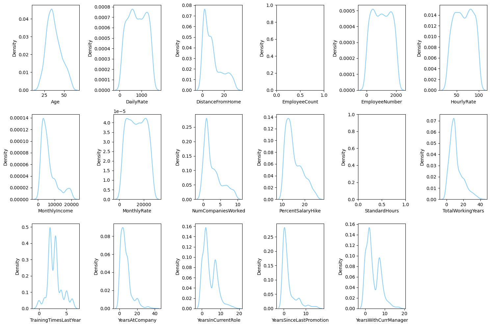
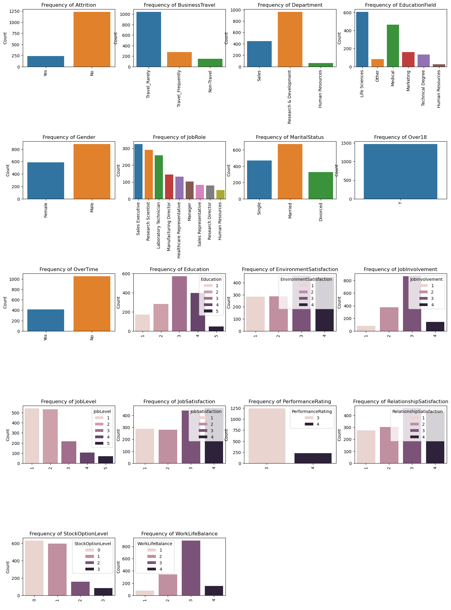
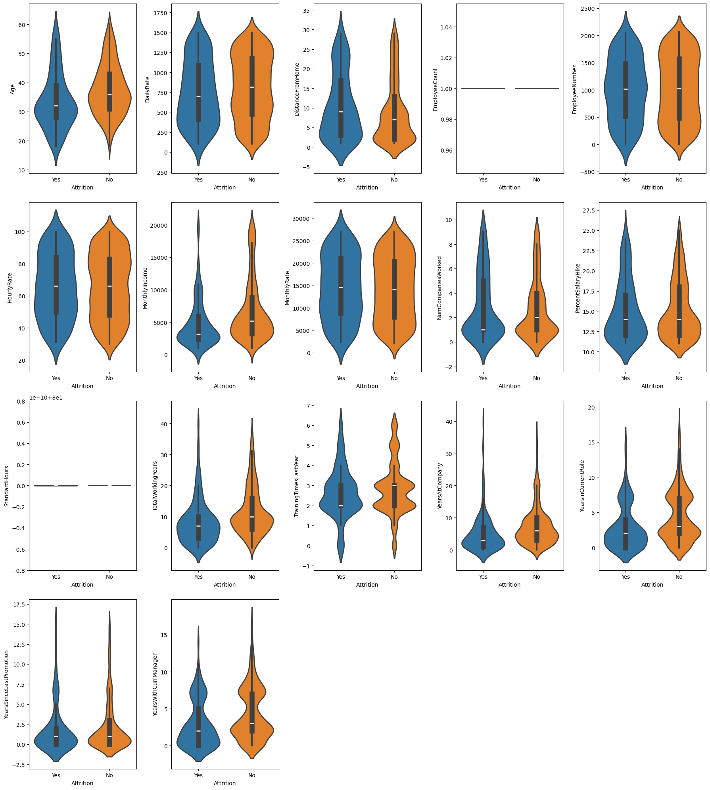
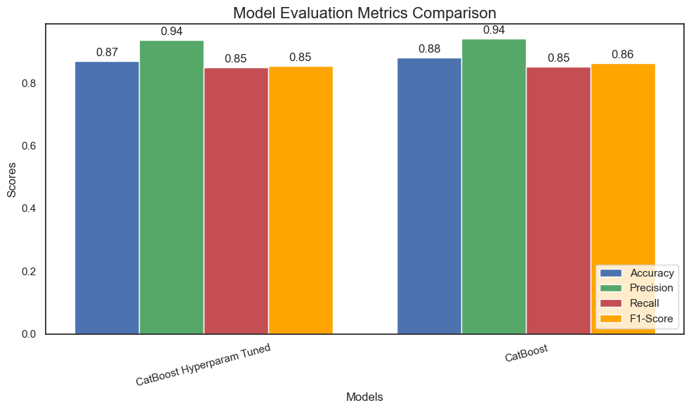
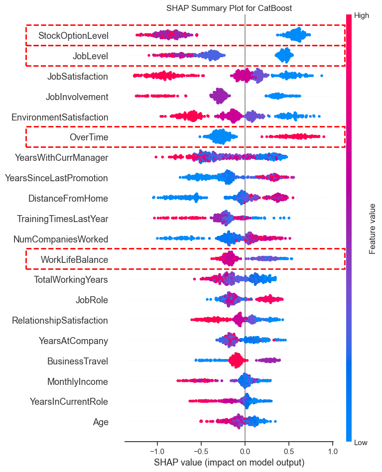
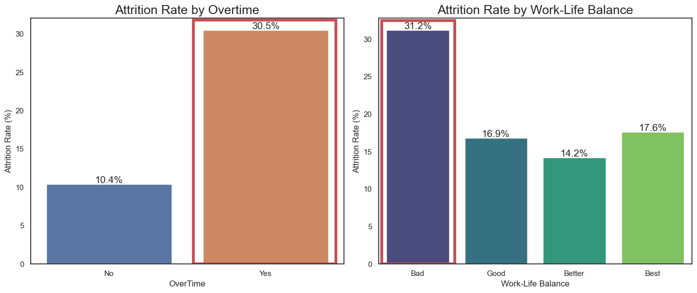
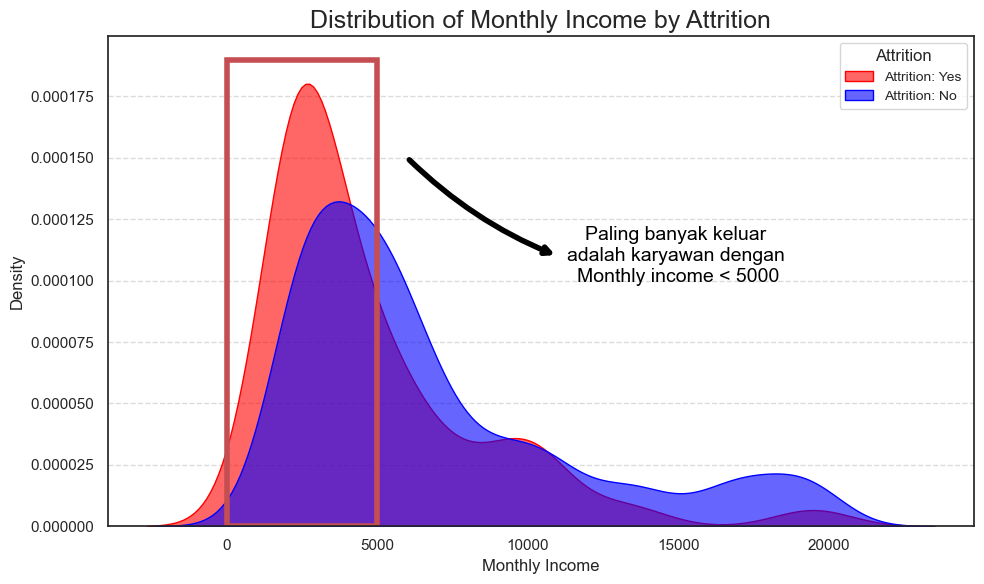
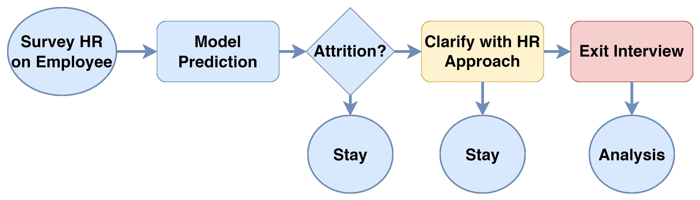

# Laporan Proyek Machine Learning - Muhammad Haniff
---
## **Domain Proyek**

Employee attrition atau tingkat keluarnya karyawan dari perusahaan merupakan tantangan kritis bagi organisasi yang ingin mempertahankan stabilitas dan produktivitas tenaga kerja. Tingginya tingkat attrition dapat menyebabkan peningkatan biaya rekrutmen, hilangnya pengetahuan institusional, serta gangguan pada operasi bisnis. Dengan memprediksi kemungkinan attrition, perusahaan dapat mengambil langkah proaktif untuk meningkatkan kepuasan karyawan, mengoptimalkan strategi retensi, dan mengalokasikan sumber daya secara lebih efisien.

Dalam beberapa tahun terakhir, solusi berbasis data semakin relevan dalam mengatasi berbagai tantangan organisasi. Prediksi attrition karyawan menggunakan data historis tenaga kerja untuk mengidentifikasi pola dan faktor yang memengaruhi turnover karyawan. Menurut penelitian yang dipublikasikan dalam *Journal of Business Management and Research*, faktor seperti Penghasilan, keseimbangan kerja-kehidupan, dan kompensasi memiliki pengaruh signifikan terhadap keputusan karyawan untuk tetap bertahan atau keluar dari perusahaan.

Proyek ini bertujuan untuk memanfaatkan analisis prediktif dalam mengatasi tantangan attrition karyawan. Dengan mengidentifikasi karyawan yang berisiko keluar, organisasi dapat mengembangkan intervensi yang lebih terfokus untuk meningkatkan retensi, mengurangi biaya, dan menciptakan budaya kerja yang positif.  

**Referensi:**  
- [Suriati, et.al (2024). "Effective Strategies for Retaining and Nurturing employees in Organizations" *Advances Jurnal Ekonomi & Bisnis*](https://www.researchgate.net/publication/381099401_Effective_Strategies_for_Retaining_and_Nurturing_employees_in_Organizations)  
- [Walid A.A, et.al (2021). "Employee Turnover: Causes, Importance and Retention Strategies" *European Journal of Business Management and Research*](https://www.researchgate.net/publication/352390912_Employee_Turnover_Causes_Importance_and_Retention_Strategies)  

---

## **Business Understanding**

### **Problem Statements**  
1. Apa saja faktor utama yang mendorong attrition karyawan dalam organisasi?  (Feature Importance)
2. Bagaimana cara memprediksi secara akurat apakah seorang karyawan kemungkinan akan keluar dari perusahaan?  (Akurasi)
3. Bagaimana organisasi dapat mengurangi risiko kehilangan karyawan berkualitas tinggi (keluarnya karyawan yang berkualitas)?  (Presisi) mereduksi FN dan mereduksi FP (Recall)
4. Bagaimana predictive analysis dapat membantu menekan biaya rekrutmen dan pelatihan akibat attrition?  

### **Goals**  
- Mengembangkan model prediksi untuk mengidentifikasi karyawan yang berisiko keluar.
- Memahami fitur-fitur utama yang memengaruhi attrition, terutama faktor-faktor yang memicu keluarnya karyawan berkualitas tinggi.
- Memberikan wawasan yang dapat ditindaklanjuti bagi tim HR untuk mengurangi biaya rekrutmen dan pelatihan akibat attrition.
- Meningkatkan strategi retensi karyawan berbasis data guna menciptakan lingkungan kerja yang lebih stabil dan produktif.

### **Solution Statement**  
Untuk menjawab pernyataan masalah dan mencapai tujuan proyek, solusi berikut akan diterapkan:  

1. **Pengembangan Model Predictive**  
   - Mengembangkan dan mengevaluasi model machine learning yang mampu memprediksi dengan akurasi tinggi apakah seorang karyawan berisiko mengalami attrition. Model ini dirancang untuk meminimalkan False Negatives(FN): dimana model memprediksi karyawan attrition namun aktualnya tidak dan False Positives(FP): dimana model memprediksi karyawan non attrition namun aktualnya Attrition. Hal ini diupayakan guna memastikan prediksi yang dapat diandalkan.  

2. **Analisis Feature Importance**  
   - Mengidentifikasi faktor-faktor utama yang memengaruhi attrition karyawan dengan menggunakan analisis feature importance dan interpretabilitas model seperti SHAP (SHapley Additive exPlanations). Hasil analisis akan memberikan wawasan mendalam tentang faktor-faktor yang memengaruhi keputusan karyawan untuk keluar, terutama bagi karyawan berkualitas tinggi.  

3. **Pengembangan Strategi Retensi Karyawan**  
   - Menggunakan hasil prediksi dan analisis faktor utama untuk merancang strategi retensi yang efektif. Hal ini mencakup intervensi yang ditargetkan, seperti program peningkatan kesejahteraan, perbaikan kondisi kerja, untuk mengurangi risiko kehilangan karyawan berkualitas tinggi.  

4. **Optimalisasi Biaya Rekrutmen dan Pelatihan**  
   - Memberikan rekomendasi kepada tim HR berdasarkan prediksi dan analisis data untuk mengurangi biaya rekrutmen dan pelatihan akibat attrition. Pendekatan ini mencakup identifikasi dini risiko keluar karyawan sehingga langkah pencegahan dapat dilakukan lebih awal.  

5. **Evaluasi dan Implementasi Berbasis Data**  
   - Mengintegrasikan model prediksi ke dalam proses kerja tim HR sebagai alat pengambilan keputusan berbasis data. Selain itu, melakukan evaluasi secara berkala untuk memastikan efektivitas model dan strategi yang diterapkan dalam menciptakan lingkungan kerja yang lebih stabil dan produktif.  

---
## Data Understanding
Dataset yang diganakan terdiri dari 1.470 data karyawan dengan 35 fitur yang mencakup berbagai informasi, seperti usia, departemen, status pernikahan, pendapatan bulanan, lama bekerja di perusahaan, dan status attrition. Dataset ini berisi kombinasi data numerik dan kategorikal yang relevan untuk menganalisis faktor-faktor yang memengaruhi retensi dan keluarnya karyawan. Dengan menggunakan dataset ini, kita dapat mengidentifikasi pola dan hubungan antara karakteristik karyawan dan attrition untuk membantu perusahaan mempertahankan talenta terbaik dan mengurangi biaya akibat pergantian karyawan. Dataset ini diambil dari Kaggle dan dapat diakses melalui tautan berikut:  
[Employee Attrition Dataset - Kaggle](https://www.kaggle.com/datasets/patelprashant/employee-attrition/data) 

#### **Deskripsi Variabel atau Fitur**  

| **Nama Fitur**               | **Tipe Data** | **Deskripsi**                                                                 |
|-------------------------------|---------------|-------------------------------------------------------------------------------|
| Age                          | Numerik       | Usia karyawan                                                                |
| Attrition                    | Kategorikal   | Apakah karyawan keluar (*Yes/No*)                                            |
| BusinessTravel               | Kategorikal   | Frekuensi perjalanan bisnis karyawan                                         |
| DailyRate                    | Numerik       | Gaji harian                                                                  |
| Department                   | Kategorikal   | Departemen tempat karyawan bekerja                                           |
| DistanceFromHome             | Numerik       | Jarak dari rumah ke tempat kerja (dalam satuan km atau mil)                  |
| Education                    | Numerik       | Tingkat pendidikan (1 = rendah, 5 = tinggi)                                  |
| EducationField               | Kategorikal   | Bidang pendidikan karyawan                                                   |
| EmployeeCount                | Numerik       | Jumlah total karyawan (konstan)                                              |
| EmployeeNumber               | Numerik       | ID unik karyawan                                                             |
| EnvironmentSatisfaction      | Numerik       | Tingkat kepuasan terhadap lingkungan kerja (1 = rendah, 4 = tinggi)          |
| Gender                       | Kategorikal   | Jenis kelamin karyawan                                                       |
| HourlyRate                   | Numerik       | Gaji per jam                                                                 |
| JobInvolvement               | Numerik       | Tingkat keterlibatan dalam pekerjaan (1 = rendah, 4 = tinggi)                |
| JobLevel                     | Numerik       | Tingkat jabatan (1 = rendah, 5 = tinggi)                                     |
| JobRole                      | Kategorikal   | Peran/jabatan karyawan di perusahaan                                         |
| JobSatisfaction              | Numerik       | Tingkat kepuasan terhadap pekerjaan (1 = rendah, 4 = tinggi)                 |
| MaritalStatus                | Kategorikal   | Status pernikahan (Single/Married/Divorced)                                  |
| MonthlyIncome                | Numerik       | Gaji bulanan                                                                 |
| MonthlyRate                  | Numerik       | Total gaji bulanan                                                           |
| NumCompaniesWorked           | Numerik       | Jumlah perusahaan tempat karyawan pernah bekerja                             |
| Over18                       | Kategorikal   | Apakah karyawan berusia di atas 18 tahun (*Yes*)                             |
| OverTime                     | Kategorikal   | Apakah karyawan sering bekerja lembur (*Yes/No*)                             |
| PercentSalaryHike            | Numerik       | Persentase kenaikan gaji karyawan                                            |
| PerformanceRating            | Numerik       | Penilaian kinerja (1 = rendah, 4 = tinggi)                                   |
| RelationshipSatisfaction     | Numerik       | Tingkat kepuasan terhadap hubungan kerja (1 = rendah, 4 = tinggi)            |
| StandardHours                | Numerik       | Jam kerja standar (konstan: 80)                                              |
| StockOptionLevel             | Numerik       | Tingkat opsi saham karyawan (0 = rendah, 3 = tinggi)                         |
| TotalWorkingYears            | Numerik       | Total tahun pengalaman kerja karyawan                                        |
| TrainingTimesLastYear        | Numerik       | Jumlah pelatihan yang diikuti tahun lalu                                     |
| WorkLifeBalance              | Numerik       | Tingkat keseimbangan kerja-kehidupan (1 = rendah, 4 = tinggi)                |
| YearsAtCompany               | Numerik       | Lama bekerja di perusahaan saat ini (tahun)                                  |
| YearsInCurrentRole           | Numerik       | Lama menjalani peran/jabatan saat ini (tahun)                                |
| YearsSinceLastPromotion      | Numerik       | Lama waktu sejak terakhir kali mendapat promosi (tahun)                      |
| YearsWithCurrManager         | Numerik       | Lama bekerja dengan manajer saat ini (tahun)                                 |

---

#### **Eksplorasi Data (Exploratory Data Analysis)**  

1. **Ringkasan nilai Data tiap Fitur**
Berikut adalah jumlah unik dan contoh unik untuk setiap kolom dalam dataset:

| Kolom                     | Jumlah Unik | Contoh Unik                                        |
|---------------------------|-------------|----------------------------------------------------|
| Age                       | 43          | [41, 49, 37, 33]                                   |
| Attrition                 | 2           | [Yes, No]                                          |
| BusinessTravel            | 3           | [Travel_Rarely, Travel_Frequently, Non-Travel]     |
| DailyRate                 | 886         | [1102, 279, 1373, 1392]                            |
| Department                | 3           | [Sales, Research & Development, Human Resources]    |
| DistanceFromHome          | 29          | [1, 8, 2, 3]                                       |
| Education                 | 5           | [2, 1, 4, 3]                                       |
| EducationField            | 6           | [Life Sciences, Other, Medical, Marketing]         |
| EmployeeCount             | 1           | [1]                                                |
| EmployeeNumber            | 1470        | [1, 2, 4, 5]                                       |
| EnvironmentSatisfaction   | 4           | [2, 3, 4, 1]                                       |
| Gender                    | 2           | [Female, Male]                                     |
| HourlyRate                | 71          | [94, 61, 92, 56]                                   |
| JobInvolvement            | 4           | [3, 2, 4, 1]                                       |
| JobLevel                  | 5           | [2, 1, 3, 4]                                       |
| JobRole                   | 9           | [Sales Executive, Research Scientist, Laboratory Technician, …] |
| JobSatisfaction           | 4           | [4, 2, 3, 1]                                       |
| MaritalStatus             | 3           | [Single, Married, Divorced]                        |
| MonthlyIncome             | 1349        | [5993, 5130, 2090, 2909]                           |
| MonthlyRate               | 1427        | [19479, 24907, 2396, 23159]                        |
| NumCompaniesWorked        | 10          | [8, 1, 6, 9]                                       |
| Over18                    | 1           | [Y]                                                |
| OverTime                  | 2           | [Yes, No]                                          |
| PercentSalaryHike         | 15          | [11, 23, 15, 12]                                   |
| PerformanceRating         | 2           | [3, 4]                                             |
| RelationshipSatisfaction  | 4           | [1, 4, 2, 3]                                       |
| StandardHours             | 1           | [80]                                               |
| StockOptionLevel          | 4           | [0, 1, 3, 2]                                       |
| TotalWorkingYears         | 40          | [8, 10, 7, 6]                                      |
| TrainingTimesLastYear     | 7           | [0, 3, 2, 5]                                       |
| WorkLifeBalance           | 4           | [1, 3, 2, 4]                                       |
| YearsAtCompany            | 37          | [6, 10, 0, 8]                                      |
| YearsInCurrentRole        | 19          | [4, 7, 0, 2]                                       |
| YearsSinceLastPromotion   | 16          | [0, 1, 3, 2]                                       |
| YearsWithCurrManager      | 18          | [5, 7, 0, 2]                                       |
               
Penjelasan:
   - Kolom: Nama kolom dari dataset.
   - Jumlah Unik: Jumlah nilai unik yang terdapat dalam kolom tersebut.
   - Contoh Unik: Beberapa contoh nilai unik yang ada di dalam kolom tersebut.

2. Statistik Deskriptif
   - **Data Numerik**
     

   - Berdasarkan statistik deskriptif untuk data numerik, berikut adalah beberapa wawasan yang dapat diambil:
      - **Age (Usia)**:Rata-rata usia karyawan adalah **36.92 tahun**, dengan nilai **terendah 18 tahun** dan nilai **tertinggi 60 tahun**. Sebagian besar karyawan berada pada rentang usia antara **30 hingga 43 tahun**, yang menunjukkan bahwa perusahaan didominasi oleh karyawan yang cukup berpengalaman tetapi masih dalam rentang usia produktif.
      
      - **DailyRate (Tarif Harian)**: Rata-rata tarif harian adalah **802.49**, dengan variasi yang cukup besar (standar deviasi **403.51**). Nilai tarif harian terendah adalah **102** dan tertinggi **1499**. Ini menunjukkan adanya perbedaan besar dalam tingkat kompensasi harian, yang mungkin berkaitan dengan jabatan atau departemen.
      
      - **MonthlyIncome (Pendapatan Bulanan)**: Pendapatan bulanan rata-rata adalah **6502.93**, dengan nilai minimum **1009** dan maksimum **19999**. Terdapat variasi yang cukup besar pada pendapatan bulanan karyawan, yang menunjukkan bahwa beberapa karyawan mungkin memiliki jabatan atau tanggung jawab yang lebih tinggi dibandingkan yang lainnya.
      - **JobSatisfaction (Kepuasan Kerja)**: Rata-rata skor kepuasan kerja adalah **2.73**, yang menunjukkan bahwa sebagian besar karyawan mungkin memiliki tingkat kepuasan yang cukup rendah atau sedang. Skor kepuasan kerja bervariasi antara **1 hingga 4**, dengan sebagian besar karyawan memberikan skor 2 atau 3, menunjukkan adanya ruang untuk peningkatan dalam kepuasan kerja.
      
      - **WorkLifeBalance (Keseimbangan Kerja dan Kehidupan)**: Rata-rata skor keseimbangan kerja dan kehidupan adalah **2.76**, dengan sebagian besar karyawan memberikan skor **2 atau 3**, yang menunjukkan bahwa banyak karyawan merasa ada tantangan dalam menjaga keseimbangan antara pekerjaan dan kehidupan pribadi.
      
      - **TotalWorkingYears (Total Tahun Bekerja)**: Rata-rata total tahun bekerja adalah **11.28 tahun**, dengan nilai terendah **0** (mungkin karena karyawan baru) dan nilai tertinggi **40**. Hal ini menunjukkan bahwa sebagian besar karyawan memiliki pengalaman kerja lebih dari 5 tahun, tetapi ada juga karyawan yang relatif baru di perusahaan.

      - Data Kategorikal

   - Berdasarkan statistik deskriptif untuk data kategorikal, berikut adalah beberapa wawasan yang dapat diambil:
      - **Attrition (Tingkat Perputaran Karyawan)**: Mayoritas karyawan adalah **karyawan yang tidak mengundurkan diri (1233 karyawan)**, dengan hanya **237 karyawan yang mengundurkan diri**. Hal ini menunjukkan bahwa perusahaan memiliki tingkat retensi karyawan yang cukup baik.
      
      - **BusinessTravel (Perjalanan Bisnis)**: Sebagian besar karyawan melakukan perjalanan bisnis **jarang (1043 karyawan)**, sedangkan **Travel_Frequently** dan **Non-Travel** masing-masing memiliki jumlah yang lebih sedikit. Ini mungkin menunjukkan bahwa perusahaan lebih fokus pada pekerjaan yang tidak memerlukan perjalanan bisnis sering.
      
      - **Department (Departemen)**: Karyawan tersebar di **tiga departemen utama**: **Research & Development** (961 karyawan), **Sales** (383 karyawan), dan **Human Resources** (126 karyawan). Ini mengindikasikan bahwa perusahaan lebih berfokus pada penelitian dan pengembangan produk, dengan bagian sumber daya manusia yang lebih kecil.
      
      - **Gender (Jenis Kelamin)**: Mayoritas karyawan adalah **Pria (882 karyawan)**, dengan **588 karyawan Wanita**. Meskipun ada perbedaan gender, proporsi antara pria dan wanita cukup seimbang, meskipun pria sedikit lebih banyak.
      
      - **MaritalStatus (Status Pernikahan)**: Karyawan dengan status **Menikah** adalah yang terbanyak (673 karyawan), diikuti oleh yang **Single** (537 karyawan) dan **Cerai** (260 karyawan). Ini menunjukkan bahwa sebagian besar karyawan berstatus menikah, yang mungkin berhubungan dengan kestabilan pekerjaan atau status hidup pribadi mereka.
      
      - **OverTime (Lembur)**: Sebagian besar karyawan **tidak bekerja lembur (1054 karyawan)**, dengan hanya sedikit karyawan yang bekerja lembur (**416 karyawan**). Hal ini dapat menunjukkan bahwa perusahaan lebih menekankan pada efisiensi kerja selama jam kerja normal.
      
      - **JobRole (Peran Pekerjaan)**: Peran pekerjaan terbanyak adalah **Sales Executive (326 karyawan)**, diikuti oleh **Research Scientist (242 karyawan)** dan **Laboratory Technician (167 karyawan)**. Ini menunjukkan bahwa perusahaan memiliki banyak peran yang terkait dengan penjualan dan penelitian, dengan peran laboratorium yang lebih kecil.

   - Observasi Desckriptif analisis:
   - **Data Numerik** menunjukkan bahwa perusahaan memiliki keberagaman dalam usia, pendapatan, dan pengalaman kerja, tetapi sebagian besar karyawan berada dalam rentang usia produktif dengan tingkat pendapatan yang cukup bervariasi. Terdapat juga indikasi bahwa kepuasan kerja dan keseimbangan hidup kerja karyawan masih bisa ditingkatkan.
   - **Data Kategorikal** menunjukkan bahwa perusahaan memiliki tingkat retensi yang baik, dengan mayoritas karyawan berada di departemen Research & Development. Gender di perusahaan cukup seimbang, namun mayoritas karyawan tidak bekerja lembur dan tidak terlalu sering melakukan perjalanan bisnis.
   
   Laporan ini dapat memberikan gambaran umum tentang kondisi karyawan dalam perusahaan dan membantu dalam pengambilan keputusan strategis terkait pengelolaan karyawan dan perbaikan kondisi kerja.

---
3. Univariate Analysis
   - Data Numerik
      - **Boxplot** digunakan untuk melihat adanya outlier atau tidak dalam data
      - 
         - **Outlier Detection:**  
             Beberapa kolom numerik menunjukkan keberadaan outlier, seperti:  
              `MonthlyIncome`, `NumCompaniesWorked`, `PerformanceRating`, `StockOptionLevel`, `TotalWorkingYears`, `WorkLifeBalance`, `YearsAtCompany`, `YearsInCurrentRole`, `YearsSinceLastPromotion`, dan `YearsWithCurrManager`.
      - **Histogram** digunakan untuk menganalisis distribusi data
      - 
        - **Distribusi Positively Skewed:**  
     Beberapa kolom numerik menunjukkan distribusi yang miring ke kanan (positively skewed) yang menunjukan karyawan dengan pengalaman rendah, gaji rendah, entry level, lebih banyak daripada karyawan yang senior. Perbedaan yang besar antara mean dan median pada kolom seperti `MonthlyIncome` menunjukkan distribusi data yang tidak simetris.
        - **Kolom dengan Nilai Konstan:**  
     Kolom `StandardHours` dan `Over18` hanya memiliki satu nilai unik dan dapat dipertimbangkan untuk di-drop karena tidak memberikan informasi variatif.

   - Data Kategorikal
      - **bar Plot**: Menampilkan jumlah kategori untuk melihat distribusi mayoritas karyawan.
      - 
        - **Frekuensi Data Kategorikal:**  
     Beberapa variabel kategorikal menunjukkan distribusi yang tidak merata, seperti `Attrition` yang lebih dominan pada satu kategori dibandingkan lainnya.
        
      - **Pie Chart**: Menunjukkan proporsi distribusi karyawan berdasarkan tiap kategori.
      - 
      - 
        - Distribusi kolom kategorikal bervariasi namun setiap kolom menunjukkan adanya nilai yang dominan dibandingkan dengan nilai lainnya 

4. Bivariate ANalysis
   - **Violin Plot**: Digunakan untuk menganalisis distribusi data numerik berdasarkan kategori `Attrition`
    
     - Berkaitan dengan kolom numerik menunjukkan distribusi yang miring ke kanan (positively skewed) yang menunjukan karyawan dengan pengalaman rendah, gaji rendah, entry level, lebih banyak daripada karyawan yang senior.

5. Multivariate Analysis
   - **heat map** digunakan untuk melihat korelasi antara variabel numerik utama.
   - 
     - **Observasi Multivariate Analysis:**
   - **Multicollinearity Antar Fitur:**  
     Terdapat korelasi tinggi antara beberapa fitur, yang menunjukkan adanya multicollinearity: 
       - `TotalWorkingYears` dan `Age`
       - `TotalWorkingYears` dan `MonthlyIncome`  
       - `YearsInCurrentRole` dan `YearsAtCompany`  
       - `YearsWithCurrManager` dan `YearsAtCompany`  
       - `YearsWithCurrManager` dan `YearsInCurrentRole`  
     Salah satu dari pasangan fitur ini dapat dipertimbangkan untuk di-drop guna mengurangi redundansi data.
   - **Korelasi Signifikan:**  
     Korelasi cukup tinggi ditemukan antar fitur tertentu, seperti antara `PerformanceRating` dan `PercentSalaryHike`. Namun, korelasi ini belum cukup tinggi untuk secara otomatis menghapus salah satu dari fitur tersebut. 

- Kesimpulan Sementara
   - Data bersih tanpa nilai yang hilang.
   - Sebagian besar karyawan tidak mengalami turnover (`Attrition: No`).
   - Fitur seperti **MonthlyIncome** dan **TotalWorkingYears** menunjukkan pola signifikan terhadap turnover.

---

## Data Preparation
Pada tahap ini dilakukan beberapa penyesuaian pada data diantaranya,

1. Handling terhadap **Null Value**, **Missing Value**, dan **Duplicate** tidak dilakukan karena tidak ada nilai yang Null, Hilang, ataupun duplikat yang ditemukan dalam data

2. **Feature Selection**: dilakukan untuk menyeleksi fitu-fitur yang tidak relevan terhadap analysis yag dilakukan, beberapa fitur yang di buang dengan alasannya sebagai berikut, 
   - **`EmployeeNumber`**: Hanya merupakan pengenal unik untuk setiap karyawan, tidak relevan untuk analisis atau prediksi.  
   - **`EmployeeCount`**: Semua baris memiliki nilai yang sama, sehingga tidak memberikan informasi yang berarti.  
   - **`Over18`**: Semua baris memiliki nilai "Yes", sehingga tidak memberikan variasi data.  
   - **`StandardHours`**: Semua baris memiliki nilai yang sama (40 jam), sehingga tidak memberikan informasi tambahan.  
   - **`PerformanceRating`**: Hampir semua karyawan memiliki nilai yang sama hanya [3,4], sehingga fitur ini kurang bervariasi untuk digunakan dalam model prediksi.  
Dengan menghapus fitur-fitur ini, kita dapat menyederhanakan dataset tanpa kehilangan informasi yang penting.

3. **Feature Encoding**: Feature Encoding dilakukan untuk menyesuaikan data dengan tipe data objek, proses ini dilakukan agar fitur dengan tipe data object dapat digunakan untuk pelatihan model prediktif, adapun fitur encoding diterapkan pada kolom `Attrition`, `BusinessTravel`, `Gender`, `MaritalStatus`, `OverTime`, `Department`, `EducationField`, `JobRole`. Encoding dilakukan menggunakan metode label encoding, dengan penerapan label sebagai berikut,
   1. **Attrition:** 0: No, 1: Yes
   2. **BusinessTravel:** 0: Non-Travel, 1: Travel_Rarely, 2: Travel_Frequently
   3. **Department:** 0: Sales, 1: Research & Development, 2: Human Resources
   4. **EducationField:** 0: Life Sciences, 1: Medical, 2: Technical Degree, 3: Human Resources, 4: Marketing, 5: Other
   5. **Gender:** 0: Female, 1: Male
   6. **JobRole:** 0: Sales Executive, Sales Representative, 1: Research Scientist, Research Director, 2: Laboratory Technician, Healthcare Representative, 3: Manager, Human Resources, 4: Manufacturing Director
   7. **MaritalStatus:** 0: Single, 1: Married, 2: Divorced
   8. **OverTime:** 0: No, 1: Yes

4. **Normalisasi**: Normalisasi dilakukan agar pelatihan model machine learning lebih optimal karena setiap data numerikal memiliki range yang berbeda-beda. Adapun normalisasi dilakukan dengan metode MinMax Scaler, karena adanya outlier ataupun distribusi data masih masuk akal dan merepresentasikan nilai yang real dan semuanya merepresentasikan keunikan masing-masing

5. **Data Splitting**: setelah melalui beberapa tahapan preprocessing, selanjutnya dilakukan split data untuk membagi data latih dan data uji. split data dilakukan 70% untuk data latih dan 30% untuk data Uji

6. **Handle Imbalance**: dilakukan penanganan ketidakseimbangan (*imbalance handling*) menggunakan Metode **SMOTE (Synthetic Minority Oversampling Technique)**. metode ini digunakan untuk mengatasi ketidakseimbangan data antara kelas mayoritas (`No Attrition`) sebesar **84%** dan kelas minoritas (`Attrition`) sebesar **16.1%**.  

SMOTE dipilih karena metode ini:  
- **Mencegah overfitting**, terutama jika dibandingkan dengan metode oversampling sederhana.  
- **Meningkatkan representasi kelas minoritas** dengan mensintesis data baru melalui interpolasi titik data yang ada.  
- **Memperbaiki distribusi kelas**, sehingga lebih seimbang untuk pelatihan model.  

Hasil dari penerapan SMOTE menunjukkan distribusi yang seimbang dengan **50% Attrition** dan **50% No Attrition**.

---
## Modeling
Setelah melewati proses *preprocessing*, selanjutnya dilakukan tahap pemilihan algoritma  
Pada proyek ini, dilakukan pemodelan menggunakan lima algoritma *machine learning*:  
Berikut adalah penjelasan yang lebih sederhana mengenai **algoritma** dan **parameter penting** yang digunakan:

1. **Decision Tree (DT)**
**Decision Tree** adalah model yang digunakan untuk klasifikasi atau regresi dengan cara membuat serangkaian keputusan berdasarkan fitur-fitur data. Model ini sangat mudah dipahami dan diinterpretasi, tetapi bisa sangat mudah mengalami **overfitting** jika pohon terlalu dalam.
   **Parameter Utama:**
   - **`criterion`**: Fungsi untuk mengukur kualitas pemisahan (misalnya Gini atau Entropy). Pilihan yang umum adalah `gini`.
   - **`max_depth`**: Menentukan kedalaman maksimum pohon. Mengatur ini dapat mencegah **overfitting**.
   - **`min_samples_split`**: Jumlah minimum data yang dibutuhkan untuk membagi node. Nilai yang lebih besar mencegah pohon terlalu kompleks.

2. **Random Forest (RF)**
**Random Forest** adalah kumpulan pohon keputusan yang bekerja bersama untuk meningkatkan akurasi model. Dibandingkan dengan decision tree tunggal, Random Forest lebih tahan terhadap **overfitting** dan memiliki performa yang lebih stabil.
   **Parameter Utama:**
   - **`n_estimators`**: Jumlah pohon dalam hutan. Semakin banyak pohon, semakin akurat, namun lebih memakan waktu komputasi.
   - **`max_features`**: Jumlah fitur yang akan digunakan di setiap pohon. Biasanya, diatur ke `sqrt` untuk mengurangi **overfitting**.
   - **`max_depth`**: Kedalaman maksimum pohon dalam setiap estimasi. Mengontrol kompleksitas pohon untuk mencegah **overfitting**.

3. **XGBoost (XG)**
**XGBoost** adalah algoritma *boosting* yang sangat efisien, sering digunakan dalam kompetisi machine learning karena kemampuannya menangani dataset besar dengan sangat baik. Algoritma ini bekerja dengan memperbaiki kesalahan model sebelumnya secara iteratif.
   **Parameter Utama:**
   - **`learning_rate`**: Menentukan seberapa besar langkah yang diambil oleh model pada setiap iterasi. Nilai lebih kecil sering menghasilkan model yang lebih akurat, meskipun lebih lambat.
   - **`max_depth`**: Kedalaman maksimum pohon. Parameter ini mengontrol kompleksitas model, semakin dalam pohon, semakin rumit modelnya.
   - **`n_estimators`**: Jumlah pohon yang digunakan dalam model. Semakin banyak pohon, semakin baik modelnya, tetapi juga memerlukan lebih banyak waktu komputasi.
   - **`subsample`**: Proporsi data yang digunakan untuk membangun setiap pohon. Nilai antara 0.5 hingga 1 membantu mengurangi **overfitting**.

4. **CatBoost (CB)**
**CatBoost** adalah algoritma *boosting* yang dirancang untuk menangani data kategori dengan lebih baik. CatBoost dapat memberikan akurasi yang sangat baik pada data kategori tanpa memerlukan pengkodean yang rumit.
   **Parameter Utama:**
   - **`learning_rate`**: Mengontrol seberapa cepat model belajar. Nilai kecil seperti 0.01 atau 0.1 sering menghasilkan model yang lebih stabil.
   - **`depth`**: Kedalaman pohon. Semakin dalam pohon, semakin kompleks modelnya, tetapi berisiko **overfitting**.
   - **`iterations`**: Jumlah iterasi atau pohon yang dibangun selama pelatihan. Lebih banyak iterasi sering menghasilkan model yang lebih kuat, meskipun lebih memakan waktu.
   - **`l2_leaf_reg`**: Regularisasi L2 untuk menghindari **overfitting** dengan memberikan penalti pada model yang terlalu rumit.

5. **AdaBoost (AB)**
**AdaBoost** adalah algoritma *boosting* yang menggabungkan beberapa model lemah (misalnya pohon keputusan kecil) untuk membentuk model yang kuat. Algoritma ini sangat efektif untuk menangani data dengan **outliers**.
   **Parameter Utama:**
   - **`learning_rate`**: Menentukan bobot yang diberikan pada estimator baru. Nilai lebih tinggi mempercepat proses pembelajaran, tetapi berisiko **overfitting**.
   - **`n_estimators`**: Jumlah model lemah yang digunakan. Semakin banyak model, semakin kuat prediksi, tetapi bisa menyebabkan **overfitting** jika terlalu banyak.

Setiap algoritma dipilih karena memiliki karakteristik berikut:  
- **Decision Tree**: Mudah diinterpretasi namun rentan terhadap *overfitting*.  
- **Random Forest**: Kombinasi pohon keputusan yang memperbaiki generalisasi, tetapi memerlukan lebih banyak sumber daya komputasi.  
- **XGBoost**: Algoritma berbasis *gradient boosting* yang sangat efisien untuk menangani dataset besar, namun kompleks untuk dioptimalkan.  
- **AdaBoost**: Cocok untuk menangani outlier, meski sensitif terhadap *noise*.  
- **CatBoost**: Dirancang khusus untuk menangani data kategori secara efisien dengan hasil akurasi yang unggul.  

## Evaluation
Pada Projek kali ini digunakn confussion metrics untuk membantu menilai metrik evaluasi, dimana metrik evaluasi ini digunakan untuk menentukan nilai performa dan kualitas model terhadap hasil prediksi yang dilakukan. Confusion matrix adalah alat evaluasi yang digunakan untuk memahami performa model klasifikasi dengan membandingkan hasil prediksi terhadap data aktual. Dalam matriks ini terdapat empat komponen utama:

- **True Positive (TP)**: Prediksi benar pada kelas positif (misalnya, memprediksi *attrition* dan benar terjadi).  
- **True Negative (TN)**: Prediksi benar pada kelas negatif (misalnya, memprediksi *no attrition* dan benar tidak terjadi).  
- **False Positive (FP)**: Prediksi salah pada kelas positif (misalnya, memprediksi *attrition* tetapi sebenarnya *no attrition*).  
- **False Negative (FN)**: Prediksi salah pada kelas negatif (misalnya, memprediksi *no attrition* tetapi sebenarnya terjadi *attrition*).  

Metrik evaluasi yang digunakan dalam proyek ini didasarkan pada informasi dari confusion matrix untuk mengevaluasi performa model secara menyeluruh.  
   1. **Akurasi**: Akurasi mengukur persentase total prediksi yang benar dari keseluruhan data.  
        \[
        $$\text{Accuracy} = \frac{TP + TN}{TP + TN + FP + FN}$$
        \]
      - **Mengapa Dipilih**:  
        Akurasi dipilih untuk memberikan gambaran umum tentang kemampuan model dalam membuat prediksi yang benar. Hal ini relevan untuk mengukur performa model dalam kasus di mana ketidakseimbangan data telah diatasi (melalui SMOTE).  
   
   2. **Presisi**:Presisi mengukur seberapa andal model dalam memprediksi kelas positif (dalam hal ini *attrition*).  
        \[
        $$\text{Precision} = \frac{TP}{TP + FP} $$
        \]
      - **Mengapa Dipilih**:  
        Presisi penting untuk memastikan bahwa prediksi *attrition* yang diberikan oleh model tidak menghasilkan terlalu banyak *false positives*, sehingga meminimalkan kesalahan prediksi karyawan yang salah dianggap akan keluar.  
   
   3. **Recall**: Recall mengukur kemampuan model dalam menangkap semua kasus positif yang benar.  
        \[
         $$\text{Recall} = \frac{TP}{TP + FN}$$
        \]  
      - **Mengapa Dipilih**:  
        Recall diprioritaskan karena penting untuk menangkap sebanyak mungkin karyawan yang benar-benar berisiko keluar (*attrition*), terutama dalam konteks strategis untuk mencegah kerugian tenaga kerja.  
   
   4. **F1-Score**: F1-Score adalah rata-rata harmonis dari presisi dan recall. Metrik ini digunakan untuk mengukur keseimbangan antara kedua metrik tersebut.  
        \[
        $$\text{F1-Score} = 2 \cdot \frac{\text{Precision} \cdot \text{Recall}}{\text{Precision} + \text{Recall}}$$
        \]  
      - **Mengapa Dipilih**:  
        F1-Score sangat relevan untuk masalah yang melibatkan ketidakseimbangan data awal. Metrik ini memberikan evaluasi yang seimbang antara kemampuan model untuk mendeteksi kelas positif (*attrition*) dan keandalan prediksinya.

#### **Hasil Perbandingan Model**  
Hasil evaluasi kelima model diukur menggunakan metrik seperti akurasi, presisi, recall, dan F1-score. Berikut adalah perbandingan performa model:  
  

Berdasarkan hasil pelatihan, model **CatBoost** menunjukkan nilai *trade-off* terbaik di antara keempat metrik evaluasi. Oleh karena itu, model **CatBoost** dipilih sebagai model terbaik untuk tugas prediksi ini.  

- **Hyperparameter Tuning**  
Untuk meningkatkan performa, dilakukan proses *hyperparameter tuning* pada model **CatBoost** menggunakan metode **Randomized Search**. Parameter yang diuji meliputi:  
- `learning_rate`: [0.01, 0.1, 0.5]  
- `depth`: [4, 6, 8]  
- `iterations`: [100, 200, 500]  
- `l2_leaf_reg`: [1, 3, 5]  

Hasil terbaik diperoleh dengan kombinasi parameter berikut:  
- **learning_rate**: 0.1  
- **depth**: 6  
- **iterations**: 500  
- **l2_leaf_reg**: 3  

Hasil evaluasi model setelah tuning dibandingkan dengan model tanpa tuning:  
  

Namun, model **CatBoost tanpa tuning** tetap menunjukkan performa yang lebih baik dibandingkan model setelah tuning. Oleh karena itu, model tanpa tuning digunakan dalam solusi akhir. 

- Dengan Confussion Metrics sebagai berikut,

 

- Feature Importance Shap Value pada model CatBoost,

 

Berdasarkan Diagram SHAP (SHapley Additive exPlanations), didapati beberapa variabel memberikan pengaruh yang signifikan pada klasifikasi model. Variabel-variabel yang paling berkontribusi dalam memisahkan klasifikasi adalah sebagai berikut:
   
   - **StockOptionLevel**: Variabel ini mencerminkan tingkat opsi saham yang dimiliki karyawan. Semakin rendah tingkat opsi saham, semakin besar kemungkinan karyawan mengalami attrition, mengindikasikan bahwa insentif saham dapat berfungsi sebagai mekanisme retensi yang efektif.
   
   - **JobLevel**: Tingkat pekerjaan karyawan memiliki pengaruh signifikan terhadap keputusan untuk bertahan atau meninggalkan perusahaan. Karyawan pada level pekerjaan yang lebih tinggi cenderung memiliki tingkat attrition yang lebih rendah, mungkin karena kompensasi yang lebih besar atau tanggung jawab yang lebih menarik.
   
   - **Overtime**: Karyawan yang sering bekerja lembur memiliki kecenderungan attrition yang lebih tinggi. Hal ini menunjukkan bahwa keseimbangan antara kehidupan kerja dan pribadi menjadi faktor penting yang memengaruhi kepuasan kerja dan keputusan untuk tetap bekerja.
   
   - **WorkLifeBalance**: Tingkat keseimbangan kerja dan kehidupan memiliki dampak besar terhadap tingkat attrition. Karyawan yang menilai keseimbangan kerja-hidup mereka buruk lebih mungkin untuk meninggalkan perusahaan, menyoroti pentingnya menciptakan lingkungan kerja yang mendukung kesejahteraan karyawan.
   
   Analisis ini memberikan wawasan bahwa perusahaan dapat fokus pada kebijakan yang meningkatkan keseimbangan kerja-hidup, memberikan penghargaan yang kompetitif, serta mengelola beban kerja untuk mengurangi attrition dan meningkatkan retensi karyawan.

Dari proses pemodelan yang dilakukan:  
- **CatBoost** dipilih karena memiliki performa terbaik dalam hal akurasi, presisi, recall, dan F1-score.  
- Proses tuning tidak menghasilkan peningkatan signifikan, sehingga model tanpa tuning digunakan.  
- Kelebihan utama **CatBoost** adalah kemampuannya menangani data kategori secara langsung, sementara kelemahan utamanya adalah waktu pelatihan yang lebih lama dibandingkan model lain.  

Dengan model ini, kami berharap dapat memberikan prediksi yang akurat terhadap kemungkinan terjadinya *attrition* pada karyawan.

## Rekomendasi HR (Based on Modelling and Explanatory Data Analysis)
Berdasarkan hasil analisis dari proses pemodelan dan *exploratory data analysis* (EDA), berikut adalah rekomendasi strategis yang dapat diterapkan untuk mengurangi tingkat *attrition* dan meningkatkan retensi karyawan:  

1. **Pengembangan Karier (Career Development)**  
- **Fokus pada Entry dan Junior Level**:

 

  Distribusi karyawan menunjukkan bahwa mayoritas karyawan berada pada *Entry Level* (Level 1) dan *Junior Level* (Level 2). Tingkat *attrition* tertinggi terdapat pada *Entry Level* sebesar 26,3%, diikuti *Mid Level* sebesar 14,7%.  
  - **Rekomendasi**:  
    - Buat program pengembangan karier yang jelas dan terstruktur, seperti jalur promosi atau pelatihan untuk meningkatkan keterampilan karyawan.  
    - Berikan insentif tambahan, seperti bonus berbasis kinerja atau kesempatan rotasi pekerjaan untuk meningkatkan motivasi karyawan di level awal.  

2. **Lingkungan Kerja yang Seimbang (Work-Life Balance)**  
- **Overtime dan Work-Life Balance**:

  Data menunjukkan bahwa karyawan yang sering lembur (*overtime*) memiliki risiko *attrition* lebih tinggi. Selain itu, karyawan dengan penilaian *Work-Life Balance* yang buruk juga cenderung lebih mungkin untuk meninggalkan perusahaan.  
  - **Rekomendasi**:  
    - Kurangi frekuensi lembur dengan cara mendistribusikan beban kerja secara lebih merata di antara tim.  
    - Tawarkan fleksibilitas kerja, seperti opsi *remote work* atau jam kerja yang lebih fleksibel, untuk meningkatkan keseimbangan kerja-hidup.  
    - Lakukan survei berkala untuk mengukur kepuasan kerja karyawan terhadap keseimbangan kerja dan kehidupan mereka.  

3. **Insentif Saham Karyawan (Employee Stock Option)**  
- **Pentingnya Tingkat Stock Option**:  

  
  Karyawan dengan *stock option* rendah menunjukkan risiko *attrition* yang lebih tinggi.  
  - **Rekomendasi**:  
    - Tingkatkan ketersediaan opsi saham untuk karyawan di level *Entry* dan *Junior*.  
    - Gunakan *stock option* sebagai alat penghargaan bagi karyawan dengan performa tinggi, sehingga mereka merasa lebih terikat dengan perusahaan.  

4. **Pengelolaan Pendapatan Bulanan (Monthly Income)**  
- **Risiko Attrition pada Penghasilan Rendah**:

  Karyawan dengan pendapatan bulanan di bawah 5.000 memiliki tingkat *attrition* yang paling tinggi.  
  - **Rekomendasi**:  
    - Evaluasi struktur gaji untuk memastikan daya saing dengan standar industri.  
    - Berikan kompensasi tambahan seperti tunjangan kesejahteraan, bonus kinerja, atau fasilitas lain untuk mendukung karyawan dengan penghasilan rendah.  

5. **Meningkatkan Fasilitas Lingkungan Kerja**  
- Untuk meningkatkan keterlibatan dan kenyamanan karyawan, pertimbangkan perbaikan fasilitas kerja, seperti:  
  - Ruang rekreasi yang mendukung relaksasi karyawan.  
  - Program kebugaran, seperti *gym membership* atau kelas yoga.  
  - Kegiatan tim yang menyenangkan untuk mempererat hubungan antar karyawan.  

6. **Monitoring dan Evaluasi Berkelanjutan**  
- Gunakan model prediktif CatBoost untuk memonitor risiko *attrition* secara rutin.  
- Bangun dashboard analitik yang memungkinkan manajemen untuk mengidentifikasi tren dan pola *attrition* dengan cepat, sehingga langkah-langkah mitigasi dapat diambil segera.  

**Kesimpulan**  
Rekomendasi ini didasarkan pada hasil analisis mendalam dari data *attrition*. Implementasi strategi-strategi ini diharapkan dapat membantu perusahaan dalam meningkatkan retensi karyawan, menciptakan lingkungan kerja yang lebih positif, dan mengurangi biaya terkait pergantian tenaga kerja. 

## Rekomendasi Penerapan Model

## Referensi
- [Suriati, et.al (2024). "Effective Strategies for Retaining and Nurturing employees in Organizations" *Advances Jurnal Ekonomi & Bisnis*](https://www.researchgate.net/publication/381099401_Effective_Strategies_for_Retaining_and_Nurturing_employees_in_Organizations)  
- [Walid A.A, et.al (2021). "Employee Turnover: Causes, Importance and Retention Strategies" *European Journal of Business Management and Research*](https://www.researchgate.net/publication/352390912_Employee_Turnover_Causes_Importance_and_Retention_Strategies)  
- [Welbourne, T.M. (2015). "Data‐Driven Storytelling: The Missing Link in HR Data Analytics" *Employment Relations Today*. Wiley Periodicals, Inc.](https://www.researchgate.net/profile/Theresa-Welbourne/publication/271538477_Data-Driven_Storytelling_The_Missing_Link_in_HR_Data_Analytics/links/59db797eaca272ab722b760c/Data-Driven-Storytelling-The-Missing-Link-in-HR-Data-Analytics.pdf)  
- [Jhaveri, S., Khedkar, I., Kantharia, Y., & Jaswal, S. (2019). "Success Prediction using Random Forest, CatBoost, XGBoost, and AdaBoost for Kickstarter Campaigns" *2019 3rd International Conference on Computing Methodologies and Communication (ICCMC)*.](https://ieeexplore.ieee.org/abstract/document/8819828)  
- [Susmaga, R. (2004). "Confusion Matrix Visualization" *Advances in Soft Computing (AINSC, volume 25)*. Springer.](https://link.springer.com/chapter/10.1007/978-3-540-39985-8_12)  
