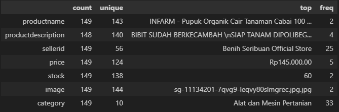
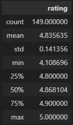
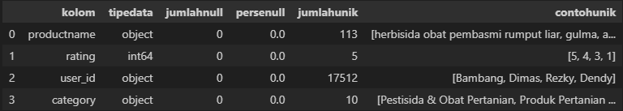
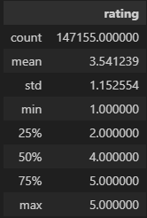

# Laporan Proyek Machine Learning - Muhammad Haniff

## Project Overview
E-commerce telah menjadi tulang punggung ekonomi digital. Namun, dengan semakin banyaknya pilihan produk, pelanggan seringkali kewalahan dalam menemukan apa yang mereka butuhkan. Proyek sistem rekomendasi ini dirancang untuk memberikan solusi yang dapat meningkatkan pengalaman pengguna dengan menyajikan produk yang relevan berdasarkan preferensi mereka. Sistem rekomendasi telah menjadi komponen penting dalam berbagai industri, termasuk e-commerce, untuk membantu pelanggan menemukan produk yang sesuai di tengah banyaknya pilihan yang tersedia.

Proyek ini penting karena memungkinkan personalisasi pengalaman pengguna, yang pada akhirnya dapat meningkatkan tingkat kepuasan pelanggan, retensi, dan pendapatan perusahaan. Berdasarkan penelitian, sistem rekomendasi dapat meningkatkan konversi penjualan hingga 20-30%. Selain itu, dengan memanfaatkan data yang tersedia, perusahaan dapat memperoleh wawasan yang lebih baik tentang perilaku pelanggan.

Hasil riset yang relevan dengan proyek ini mencakup:

- [Pushpendra K, Ramjeevan ST (2018) "Recommendation system techniques and related issues: a survey",  International Journal of Information Technology Volume 10, pages 495–501](https://link.springer.com/article/10.1007/s41870-018-0138-8)
- [Lioliang J, et.al (2018) "A trust‑based collaborative filtering algorithm for E‑commerce
recommendation system", Journal of Ambient Intelligence and Humanized Computing Volume 10, pages 3023–3034](https://link.springer.com/article/10.1007/s12652-018-0928-7)

## Business Understanding

Untuk memahami kebutuhan proyek ini, dilakukan klarifikasi terhadap masalah yang ingin diselesaikan, yaitu:

### Problem Statements:

1. Bagaimana cara memberikan rekomendasi produk yang relevan kepada pengguna berdasarkan preferensi mereka?
2. Bagaimana memanfaatkan data ulasan pengguna dan informasi produk untuk menciptakan pengalaman yang lebih personal?
3. Bagaimana mengoptimalkan performa sistem rekomendasi untuk meningkatkan kepuasan pengguna?

### Goals:

- Mengembangkan sistem rekomendasi yang dapat menyarankan produk secara akurat kepada pengguna.
- Mengimplementasikan dua pendekatan solusi, yaitu content-based filtering dan collaborative filtering, untuk memberikan rekomendasi yang optimal.
- Menyediakan evaluasi kinerja sistem rekomendasi menggunakan metrik yang sesuai.

### Solution Statements:
Untuk mencapai tujuan tersebut, dua pendekatan berikut akan diterapkan:

- Content-Based Filtering

  - Menggunakan informasi produk, seperti deskripsi dan kategori, untuk membuat profil produk dan mencocokkannya dengan preferensi pengguna.

  - Memanfaatkan teknik Natural Language Processing (NLP) untuk mengekstrak fitur penting dari deskripsi produk.

- Collaborative Filtering

  - Menggunakan data interaksi pengguna, seperti ulasan dan rating, untuk mengidentifikasi pola dan preferensi.

  - Memanfaatkan algoritma seperti matrix factorization untuk merekomendasikan produk berdasarkan kesamaan antar pengguna atau produk.

Pendekatan ini diharapkan dapat menyelesaikan permasalahan yang ada, serta meningkatkan pengalaman pengguna secara keseluruhan dengan menyajikan produk yang relevan secara efisien.

## Data Understanding

Dataset yang digunakan pada proyek ini merupakan data opensource yang ditemukan di [Kaggle](https://www.kaggle.com/datasets/salmanafh/product-recommendation-dataset-agrease-capstone). Dataset ini berasal dari sebuah toko e-commerce yang fokus menjual produk-produk pertanian, seperti alat pertanian, pupuk, dan benih. Dataset terdiri dari dua bagian utama:

### Deskripsi Dataset

#### **Product Dataset**

| Nama Kolom           | Tipe Data | Deskripsi                                                        | Jumlah Null | Persen Null | Jumlah Unik | Contoh Unik                                                   |
| -------------------- | --------- | ---------------------------------------------------------------- | ----------- | ----------- | ----------- | ----------------------------------------------------------- |
| `productname`        | Object    | Nama produk (cocok dengan nama produk di user_reviews dataset). | 0           | 0.00%       | 143         | [obat pembasmi pohon dan akar, racun pohon, st...]          |
| `productdescription` | Object    | Deskripsi dari produk.                                           | 1           | 0.67%       | 140         | [Nufarm Starlon Herbisida Sistemik\n\nIsi : 10...]         |
| `rating`             | Float64   | Rata-rata penilaian produk secara keseluruhan.                   | 0           | 0.00%       | 86          | [4.9, 5.0, 4.8, 4.7]                                         |
| `sellerid`           | Object    | Identifikasi unik dari penjual.                                  | 0           | 0.00%       | 56          | [she-basmi, Panda Farm, benihkita, Sayurbox]                 |
| `price`              | Object    | Harga produk.                                                    | 0           | 0.00%       | 124         | [Rp38.000,00, Rp25.500,00, Rp49.550,00, Rp35.0...]          |
| `stock`              | Object    | Jumlah stok produk yang tersedia.                                | 0           | 0.00%       | 138         | [96653, 91, 33, 95969]                                       |
| `image`              | Object    | URL atau path gambar produk.                                     | 0           | 0.00%       | 144         | [9a6345e2-6ae6-4a44-b7cd-042a0a0e6f8b.jpg.webp...]           |
| `category`           | Object    | Kategori produk.                                                 | 0           | 0.00%       | 10          | [Pestisida dan Obat tanaman, Produk Pertanian ...]           |

**Jumlah Data**: 149 entri.

- **Catatan**:
  - Terdapat satu nilai null pada kolom `productdescription`.
  - Data pada kolom `price` dan `stock` kemungkinan masih berbentuk string, yang membutuhkan konversi tipe data untuk analisis lebih lanjut.

#### **User Reviews Dataset**

| Nama Kolom    | Tipe Data | Deskripsi                                       | Jumlah Null | Persen Null | Jumlah Unik | Contoh Unik                                                   |
| ------------- | --------- | ----------------------------------------------- | ----------- | ----------- | ----------- | ----------------------------------------------------------- |
| `productname` | Object    | Nama produk yang diulas.                        | 0           | 0.00%       | 113         | [herbisida obat pembasmi rumput liar, gulma, a...]          |
| `rating`      | Int64     | Penilaian pengguna terhadap produk (skala 1-5). | 0           | 0.00%       | 5           | [5, 4, 3, 1]                                                |
| `user_id`     | Object    | Identifikasi unik dari pengguna.                | 0           | 0.00%       | 17512       | [Bambang, Dimas, Rezky, Dendy]                              |
| `category`    | Object    | Kategori produk yang diulas.                    | 0           | 0.00%       | 10          | [Pestisida & Obat Pertanian, Produk Pertanian ...]           |

**Jumlah Data**: 147,155 entri.

- **Catatan**:
  - Tidak ada nilai null pada dataset ini.

### Exploratory Data Analysis

#### **Deskripsi Statistik**:
  - Dataset product
  - Kolom Kategorikal
  - 
    - **productname:**
      * Terdapat 149 produk unik dengan nama yang bervariasi.
      * Produk dengan nama "INFARM - Pupuk Organik Cair Tanaman Cabai 100 ..." memiliki frekuensi tertinggi (2 kali).
      * Indikasi: Adanya beberapa produk dengan nama serupa atau duplikat.
    - **productdescription:**
      * Deskripsi produk beragam dengan beberapa deskripsi yang muncul lebih dari sekali.
    - **sellerid:**
      * Ada 56 seller yang berbeda.
      * "Benih Seribuan Official Store" adalah seller dengan produk terbanyak.
    - **category:**
      * Kategori "Alat dan Mesin Pertanian" mendominasi
    - **image:**
      * Sebagian besar produk memiliki gambar unik.
      * Beberapa produk memiliki nama file gambar yang sama.
    - **price:**
      * Produk baling banyak diharga: Rp145.000
      * Variasi harga cukup signifikan.
    - **stock:**
      * Rata-rata stok: 60 unit
      * Variasi jumlah stok.

  - Kolom Numerikal
  - 
    - **rating:**
      * Rata-rata rating: 4.83
      * Indikasi: Produk secara umum memiliki kualitas baik dan disukai pelanggan.

  - Dataset user_reviews
    - Kolom Kategorikal
    - 
      - **productname:**
        * Terdapat 113 produk unik yang memiliki ulasan.
        * Produk "Digital Soil Analyzer Tester Meter Alat Ukur p..." paling banyak diulas.
      - **user_id:**
        * Terdapat 17512 pengguna unik.
        * Pengguna "Muhammad" paling banyak memberikan ulasan.
      - **category:**
        * Kategori "Sarana dan Peralatan Irigasi" paling banyak mendapatkan ulasan.

    - Kolom Numerikal
    - 
      - **rating:**
        * Rata-rata rating: 3.54
        * Lebih rendah dibandingkan rating produk.
        * Indikasi: Mungkin ada faktor lain yang mempengaruhi penilaian pengguna.

### Univariate Analysis
#### Product Dataset
- **Kategori Produk**:
  - Produk dikategorikan ke dalam beberapa jenis, seperti elektronik, pakaian, dan pertanian. Distribusi kategori menunjukkan dominasi beberapa kategori tertentu.

- **Pola Interaksi Pengguna**:
  - Sebagian besar pengguna hanya memberikan ulasan untuk beberapa produk, menunjukkan adanya long-tail effect pada data ulasan.

- **Distribusi Rating**:

  - Pada dataset `user_reviews`, rating berkisar dari 1 hingga 5, dengan sebagian besar ulasan memberikan rating tinggi (4 atau 5).

- **Kategori Produk**:

  - Produk dikategorikan ke dalam beberapa jenis, seperti elektronik, pakaian, dan pertanian. Distribusi kategori menunjukkan dominasi beberapa kategori tertentu.

- **Pola Interaksi Pengguna**:

  - Sebagian besar pengguna hanya memberikan ulasan untuk beberapa produk, menunjukkan adanya long-tail effect pada data ulasan.
 
#### User Reviews Dataset

## Data Perparation
1. Handle Null Value
2. Handle Duplicate
3. Handle Miss-Spelling

### **Content-Based Filtering**
### **Collaborative Filterring**

## Modelling
### **Content-Based Filtering**
### **Collaborative Filterring**
**Matrix Factorization dengan SVD untuk Collaborative Filtering**  

Matrix Factorization adalah salah satu pendekatan yang digunakan dalam sistem rekomendasi untuk memprediksi preferensi pengguna terhadap item berdasarkan pola yang sudah ada di data. Salah satu metode yang populer untuk matrix factorization adalah **Singular Value Decomposition (SVD)**.

### Konsep SVD
SVD adalah metode dekomposisi matriks yang memecah sebuah matriks \( R \) (misalnya matriks rating pengguna-item) menjadi tiga matriks:

\[
$$R = U \cdot \Sigma \cdot V^T$$
\]

1. **\( U \)** (User Matrix): Representasi fitur laten pengguna.  
2. **\( $$\Sigma$$ \)** (Singular Value Matrix): Matriks diagonal yang mengandung singular values, yang menunjukkan kepentingan setiap fitur laten.  
3. **\( $$V^T$$ \)** (Item Matrix): Representasi fitur laten item.

### Implementasi dalam Collaborative Filtering
1. **Input Data**: 
   - Matriks rating \( R \), di mana baris merepresentasikan pengguna dan kolom merepresentasikan item. Nilai dalam matriks adalah rating yang diberikan oleh pengguna terhadap item.  
   - Jika ada nilai yang kosong (missing values), biasanya diisi dengan nilai rata-rata atau dibiarkan kosong dalam beberapa implementasi.

2. **Reduksi Dimensi**: 
   - SVD memecah matriks \( $$R$$ \) menjadi tiga matriks, namun kita dapat memilih hanya beberapa singular values teratas dari \( $$\Sigma$$ \) untuk mengurangi dimensi dan menangkap pola penting saja. Ini membantu dalam menangani data yang besar dan mengurangi noise.

3. **Rekonstruksi Matriks**:
   - Matriks \( $$R'$$ \), hasil perkalian \( $$U$$ \), \( $$\Sigma$$ \), dan \( V^T \), merepresentasikan prediksi rating yang bisa diberikan pengguna terhadap item. Jika ada nilai kosong di matriks awal \( $$R$$ \), nilai tersebut akan terisi dengan prediksi rating.

4. **Prediksi**:
   - Dari matriks rekonstruksi \( $$R'$$ \), kita dapat memilih **Top-N Recommendation** untuk setiap pengguna berdasarkan prediksi rating tertinggi.

### Kelebihan dan Kekurangan SVD
#### Kelebihan:
- Mampu menangkap pola laten antara pengguna dan item, bahkan jika data rating yang tersedia sparsity (jarang).
- Reduksi dimensi membuat algoritma lebih efisien untuk dataset yang besar.

#### Kekurangan:
- Membutuhkan preprocessing, terutama jika ada nilai kosong dalam matriks rating.
- Tidak mempertimbangkan data tambahan, seperti metadata item atau demografi pengguna (murni berbasis data interaksi).

### Contoh Singkat
Misalkan ada matriks rating:

|          | Item A | Item B | Item C |
|----------|--------|--------|--------|
| User 1   | 5      | ?      | 4      |
| User 2   | ?      | 3      | 2      |
| User 3   | 1      | ?      | ?      |

Menggunakan SVD, kita dapat memprediksi nilai **"?"** berdasarkan pola dalam matriks, dan memberikan rekomendasi seperti:  
- "Item B cocok untuk User 1 dengan rating prediksi 4.5."

Metode ini sangat efektif dalam sistem rekomendasi berbasis data historis!

## Evaluation
1. Mean Square Error (MSE)
2. Root Mean Square Error (RMSE)

### Model Evaluation
#### **Content-Based Filtering**
#### **Collaborative Filterring**

## Kesimpulan

## Referensi
- [Pushpendra K, Ramjeevan ST (2018) "Recommendation system techniques and related issues: a survey",  International Journal of Information Technology Volume 10, pages 495–501](https://link.springer.com/article/10.1007/s41870-018-0138-8)
- [Lioliang J, et.al (2018) "A trust‑based collaborative filtering algorithm for E‑commerce
recommendation system", Journal of Ambient Intelligence and Humanized Computing Volume 10, pages 3023–3034](https://link.springer.com/article/10.1007/s12652-018-0928-7)
- https://towardsdatascience.com/recommender-system-singular-value-decomposition-svd-truncated-svd-97096338f361
- https://medium.com/@connectwithghosh/simple-matrix-factorization-example-on-the-movielens-dataset-using-pyspark-9b7e3f567536
