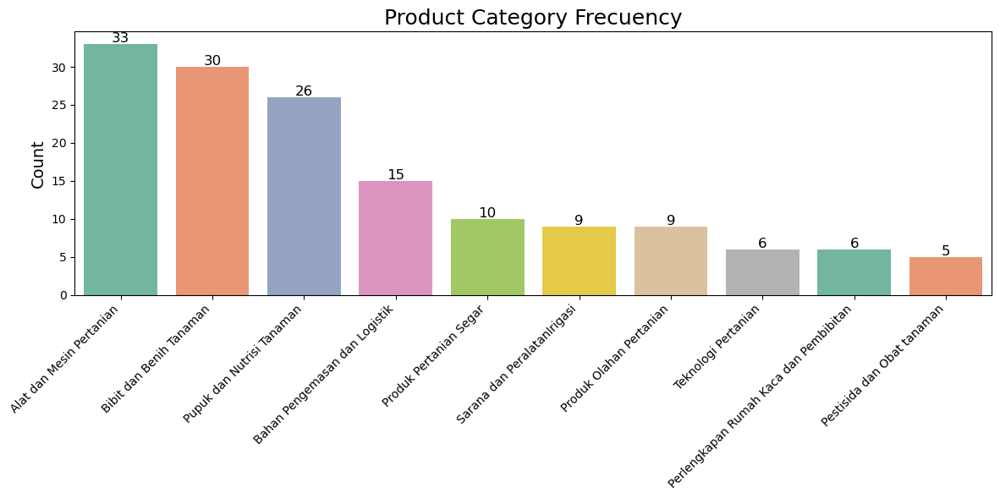

# Laporan Proyek Machine Learning - Muhammad Haniff

## Project Overview
E-commerce telah menjadi tulang punggung ekonomi digital. Namun, dengan semakin banyaknya pilihan produk, pelanggan seringkali kewalahan dalam menemukan apa yang mereka butuhkan. Proyek sistem rekomendasi ini dirancang untuk memberikan solusi yang dapat meningkatkan pengalaman pengguna dengan menyajikan produk yang relevan berdasarkan preferensi mereka. Sistem rekomendasi telah menjadi komponen penting dalam berbagai industri, termasuk e-commerce, untuk membantu pelanggan menemukan produk yang sesuai di tengah banyaknya pilihan yang tersedia [1].

Proyek ini penting karena memungkinkan personalisasi pengalaman pengguna, yang pada akhirnya dapat meningkatkan tingkat kepuasan pelanggan, retensi, dan pendapatan perusahaan. Berdasarkan penelitian, sistem rekomendasi dapat meningkatkan konversi penjualan sebuah E-Commerce. Selain itu, dengan memanfaatkan data yang tersedia, perusahaan dapat memperoleh wawasan yang lebih baik tentang perilaku pelanggan[2].

Hasil riset yang relevan dengan proyek ini mencakup:
- [Lioliang J, et.al (2018) "A trust‑based collaborative filtering algorithm for E‑commerce
recommendation system", Journal of Ambient Intelligence and Humanized Computing Volume 10, pages 3023–3034](https://link.springer.com/article/10.1007/s12652-018-0928-7)
- [Pushpendra K, Ramjeevan ST (2018) "Recommendation system techniques and related issues: a survey",  International Journal of Information Technology Volume 10, pages 495–501](https://link.springer.com/article/10.1007/s41870-018-0138-8)

## Business Understanding

Untuk memahami kebutuhan proyek ini, dilakukan klarifikasi terhadap masalah yang ingin diselesaikan, yaitu:

### Problem Statements:

1. Bagaimana cara memberikan rekomendasi produk yang relevan kepada pengguna berdasarkan preferensi mereka?
2. Bagaimana memanfaatkan data ulasan pengguna dan informasi produk untuk menciptakan pengalaman yang lebih personal?
3. Bagaimana mengoptimalkan performa sistem rekomendasi untuk meningkatkan kepuasan pengguna?

### Goals:

- Mengembangkan sistem rekomendasi yang dapat menyarankan produk secara akurat kepada pengguna.
- Mengimplementasikan dua pendekatan solusi, yaitu content-based filtering dan collaborative filtering, untuk memberikan rekomendasi yang optimal.
- Menyediakan evaluasi kinerja sistem rekomendasi menggunakan metrik yang sesuai.

### Solution Statements:
Untuk mencapai tujuan tersebut, dua pendekatan berikut akan diterapkan:

- Content-Based Filtering

  - Menggunakan informasi produk, seperti deskripsi dan kategori, untuk membuat profil produk dan mencocokkannya dengan preferensi pengguna.

  - Memanfaatkan teknik Natural Language Processing (NLP) untuk mengekstrak fitur penting dari deskripsi produk.

- Collaborative Filtering

  - Menggunakan data interaksi pengguna, seperti ulasan dan rating, untuk mengidentifikasi pola dan preferensi.

  - Memanfaatkan algoritma seperti matrix factorization untuk merekomendasikan produk berdasarkan kesamaan antar pengguna atau produk.

Pendekatan ini diharapkan dapat menyelesaikan permasalahan yang ada, serta meningkatkan pengalaman pengguna secara keseluruhan dengan menyajikan produk yang relevan secara efisien.

## Data Understanding

Dataset yang digunakan pada proyek ini merupakan data opensource yang ditemukan di [Kaggle](https://www.kaggle.com/datasets/salmanafh/product-recommendation-dataset-agrease-capstone). Dataset ini berasal dari sebuah toko e-commerce yang fokus menjual produk-produk pertanian, seperti alat pertanian, pupuk, dan benih. Dataset terdiri dari dua bagian utama:

### Deskripsi Dataset

#### **Product Dataset**

| Nama Kolom           | Tipe Data | Deskripsi                                                        | Jumlah Null | Persen Null | Jumlah Unik | Contoh Unik                                                   |
| -------------------- | --------- | ---------------------------------------------------------------- | ----------- | ----------- | ----------- | ----------------------------------------------------------- |
| `productname`        | Object    | Nama produk (cocok dengan nama produk di user_reviews dataset). | 0           | 0.00%       | 143         | [obat pembasmi pohon dan akar, racun pohon, st...]          |
| `productdescription` | Object    | Deskripsi dari produk.                                           | 1           | 0.67%       | 140         | [Nufarm Starlon Herbisida Sistemik\n\nIsi : 10...]         |
| `rating`             | Float64   | Rata-rata penilaian produk secara keseluruhan.                   | 0           | 0.00%       | 86          | [4.9, 5.0, 4.8, 4.7]                                         |
| `sellerid`           | Object    | Identifikasi unik dari penjual.                                  | 0           | 0.00%       | 56          | [she-basmi, Panda Farm, benihkita, Sayurbox]                 |
| `price`              | Object    | Harga produk.                                                    | 0           | 0.00%       | 124         | [Rp38.000,00, Rp25.500,00, Rp49.550,00, Rp35.0...]          |
| `stock`              | Object    | Jumlah stok produk yang tersedia.                                | 0           | 0.00%       | 138         | [96653, 91, 33, 95969]                                       |
| `image`              | Object    | URL atau path gambar produk.                                     | 0           | 0.00%       | 144         | [9a6345e2-6ae6-4a44-b7cd-042a0a0e6f8b.jpg.webp...]           |
| `category`           | Object    | Kategori produk.                                                 | 0           | 0.00%       | 10          | [Pestisida dan Obat tanaman, Produk Pertanian ...]           |

**Jumlah Data**: 149 entri.

- **Catatan**:
  - Terdapat satu nilai null pada kolom `productdescription`.
  - Data pada kolom `price` dan `stock` kemungkinan masih berbentuk string, yang membutuhkan konversi tipe data untuk analisis lebih lanjut.

#### **User Reviews Dataset**

| Nama Kolom    | Tipe Data | Deskripsi                                       | Jumlah Null | Persen Null | Jumlah Unik | Contoh Unik                                                   |
| ------------- | --------- | ----------------------------------------------- | ----------- | ----------- | ----------- | ----------------------------------------------------------- |
| `productname` | Object    | Nama produk yang diulas.                        | 0           | 0.00%       | 113         | [herbisida obat pembasmi rumput liar, gulma, a...]          |
| `rating`      | Int64     | Penilaian pengguna terhadap produk (skala 1-5). | 0           | 0.00%       | 5           | [5, 4, 3, 1]                                                |
| `user_id`     | Object    | Identifikasi unik dari pengguna.                | 0           | 0.00%       | 17512       | [Bambang, Dimas, Rezky, Dendy]                              |
| `category`    | Object    | Kategori produk yang diulas.                    | 0           | 0.00%       | 10          | [Pestisida & Obat Pertanian, Produk Pertanian ...]           |

**Jumlah Data**: 147,155 entri.

- **Catatan**:
  - Tidak ada nilai null pada dataset ini.

### Exploratory Data Analysis

#### **Deskripsi Statistik**:
  - Dataset product
  - Kolom Kategorikal
  - 
    - **productname:**
      * Terdapat 149 produk unik dengan nama yang bervariasi.
      * Produk dengan nama "INFARM - Pupuk Organik Cair Tanaman Cabai 100 ..." memiliki frekuensi tertinggi (2 kali).
      * Indikasi: Adanya beberapa produk dengan nama serupa atau duplikat.
    - **productdescription:**
      * Deskripsi produk beragam dengan beberapa deskripsi yang muncul lebih dari sekali.
    - **sellerid:**
      * Ada 56 seller yang berbeda.
      * "Benih Seribuan Official Store" adalah seller dengan produk terbanyak.
    - **category:**
      * Kategori "Alat dan Mesin Pertanian" mendominasi
    - **image:**
      * Sebagian besar produk memiliki gambar unik.
      * Beberapa produk memiliki nama file gambar yang sama.
    - **price:**
      * Produk baling banyak diharga: Rp145.000
      * Variasi harga cukup signifikan.
    - **stock:**
      * Rata-rata stok: 60 unit
      * Variasi jumlah stok.

  - Kolom Numerikal
  - 
    - **rating:**
      * Rata-rata rating: 4.83
      * Indikasi: Produk secara umum memiliki kualitas baik dan disukai pelanggan.

  - Dataset user_reviews
    - Kolom Kategorikal
    - 
      - **productname:**
        * Terdapat 113 produk unik yang memiliki ulasan.
        * Produk "Digital Soil Analyzer Tester Meter Alat Ukur p..." paling banyak diulas.
      - **user_id:**
        * Terdapat 17512 pengguna unik.
        * Pengguna "Muhammad" paling banyak memberikan ulasan.
      - **category:**
        * Kategori "Sarana dan Peralatan Irigasi" paling banyak mendapatkan ulasan.

    - Kolom Numerikal
    - 
      - **rating:**
        * Rata-rata rating: 3.54
        * Lebih rendah dibandingkan rating produk.
        * Indikasi: Mungkin ada faktor lain yang mempengaruhi penilaian pengguna.


### Univariate Analysis
#### Product Dataset
- **Sebaran Rata-rata Rating untuk Setiap Produk**:


- **Observasi:**
  - Didapati adanya nilai distribusi right-skewed, dimana average rating untuk tiap produk paling banyak di-angka 4.8 sampai 5,  dengan nilai rata-rata 4.84 dan nilai paling banyak 4.9

  - Rating rata-rata yang tinggi dan penyebaran yang sempit menunjukkan bahwa produk secara umum sangat disukai oleh pelanggan.

  - Konsentrasi rating di sekitar nilai tertinggi mungkin menunjukkan adanya bias dalam ulasan atau kualitas produk yang konsisten baik.

- **Frekuensi Kategori Produk**:



- **Observasi:**
  - Kategori "Alat dan Mesin Pertanian" adalah yang paling banyak muncul dalam dataset, dengan total 33 produk. Diikuti oleh "Bibit dan Benih Tanaman" sebanyak 30 produk dan "Pupuk dan Nutrisi Tanaman" sebanyak 26 produk.
  - Distribusi menurun: Jumlah produk dalam kategori lainnya menurun secara bertahap, dengan kategori paling sedikit adalah "Pestisida dan Obat Tanaman" yang hanya memiliki 5 produk.
  - Ketimpangan Frekuensi: Kategori atas seperti "Alat dan Mesin Pertanian," "Bibit dan Benih Tanaman," dan "Pupuk dan Nutrisi Tanaman" mendominasi hampir setengah dari total produk dalam dataset.
Sebaliknya, kategori dengan frekuensi rendah seperti "Pestisida dan Obat Tanaman", "Perlengkapan Rumah Kaca dan Pembibitan," dan "Teknologi Pertanian" hanya memiliki sedikit produk, menunjukkan distribusi yang tidak seimbang antar kategori.
  - Observasi Berdasarkan Tren Pasar: Kebutuhan tinggi untuk kategori alat dan benih. Dominasi kategori "Alat dan Mesin Pertanian" dan "Bibit dan Benih Tanaman" mencerminkan fokus utama pada produk yang mendukung proses pertanian langsung, seperti pengolahan lahan, pembibitan, dan penanaman.
  - Rendahnya produk teknologi dan pestisida: Kategori seperti "Teknologi Pertanian" dan "Pestisida dan Obat Tanaman" memiliki frekuensi rendah, yang dapat menunjukkan permintaan pasar yang lebih kecil atau kurangnya penyediaan produk-produk ini dalam dataset.

 
#### User Reviews Dataset
- **Frekuensi dan Distribusi rating yang Diberikan Pengguna**:


- **Observasi:**
  - Rating paling sering: Rating 5 adalah yang paling sering diberikan, dengan total 41.809 ulasan, mencerminkan sebagian besar pengguna sangat puas dengan produk.
  - Rating kedua terbanyak: Rating 2 berada di posisi kedua dengan 37.036 ulasan, menunjukkan sejumlah besar ketidakpuasan pengguna.
  - Rating netral: Rating 3 berada di tengah-tengah dengan 34.622 ulasan, mencerminkan pengalaman pengguna yang biasa saja.
  - Rating jarang diberikan: Rating 1 adalah yang paling sedikit diberikan, hanya 208 ulasan, menunjukkan bahwa hanya sedikit pengguna yang memberikan penilaian terendah.
  - Ketimpangan Distribusi: Sebagian besar ulasan berada di rating tinggi (5) dan rendah (2), menciptakan pola distribusi yang terpolarisasi. Jumlah ulasan dengan rating netral (3) hampir sama dengan rating 2 dan sedikit lebih rendah dibandingkan rating 4.
  - Rating sangat rendah jarang terjadi: Rating 1 sangat jarang diberikan dibandingkan rating lainnya, yang menunjukkan bahwa mayoritas pengguna tidak memberikan ulasan negatif ekstrim.

- Observasi Berdasarkan Kecenderungan Pengguna:
    - Mayoritas puas: Dominasi rating 5 menunjukkan bahwa pengguna cenderung puas atau sangat puas terhadap produk atau layanan yang mereka terima.
    - Peningkatan potensi kualitas: Rating 2 yang tinggi menunjukkan adanya kelompok signifikan pengguna yang tidak puas. Ini dapat menjadi indikasi untuk memperbaiki produk atau layanan.
    - Kurangnya ulasan ekstrem negatif: Jumlah rating 1 yang sangat kecil menunjukkan bahwa kasus ketidakpuasan ekstrim jarang terjadi, yang merupakan hal positif.
 
 
- **Frekuensi Kategori Produk yang Terjual**:


- **Observasi:**
  - Kategori paling populer: Sarana dan Peralatan Irigasi adalah kategori yang paling sering diulas/terjual, dengan total 19.883 ulasan. Hal ini menunjukkan tingginya permintaan terhadap produk-produk terkait irigasi. Alat dan Mesin Pertanian berada di peringkat kedua dengan 19.765 ulasan. Perlengkapan Rumah Kaca dan Pembibitan berada di posisi ketiga dengan 18.145 ulasan. Kedua kategori ini menunjukkan popularitas produk-produk yang mendukung kegiatan pertanian secara langsung.
  - Kategori dengan Jumlah Ulasan Sedang: 'Produk Olahan Pertanian', Kategori ini memiliki 17.515 ulasan, mencerminkan permintaan yang cukup signifikan untuk produk-produk yang telah diolah. 'Produk Pertanian Segar': Dengan 16.285 ulasan, kategori ini menunjukkan bahwa konsumen juga tertarik pada hasil pertanian yang segar. 'Teknologi Pertanian': Memiliki 14.920 ulasan, menandakan minat terhadap inovasi teknologi dalam bidang pertanian.
  - Kategori dengan Jumlah Ulasan Rendah, 'Bibit dan Benih Tanaman': Dengan hanya 696 ulasan, kategori ini menjadi yang paling sedikit diulas. Hal ini menunjukkan permintaan yang relatif rendah dibandingkan kategori lain. 'Pupuk dan Nutrisi Tanaman': Kategori ini memiliki 12.587 ulasan, menempatkannya dalam kelompok dengan permintaan sedang.
  - Ketimpangan Distribusi: Terdapat perbedaan besar antara kategori dengan jumlah ulasan tertinggi (Sarana dan Peralatan Irigasi) dan terendah (Bibit dan Benih Tanaman). Hal ini mencerminkan perbedaan fokus konsumen terhadap jenis produk yang dibutuhkan atau diminati.
 
### Bivariate Analysis
 - **Frekuensi Rating pada Top 5 Produk yang Terjual**:


**Observasi:**
1. **Alat dan Mesin Pertanian:**
    - **Rating tertinggi (4 dan 5):** Rating **4** dan **5** mendominasi kategori ini, masing-masing dengan **5.751** dan **4.730** ulasan, menunjukkan tingkat kepuasan yang cukup tinggi di antara konsumen.
    - **Rating sedang (3):** Rating **3** memiliki **3.734** ulasan, yang mencerminkan adanya konsumen dengan pengalaman netral.
    - **Rating rendah (1 dan 2):** Rating **2** mencapai **5.528**, cukup signifikan, sedangkan **rating 1** hanya ada **22** ulasan.

2. **Perlengkapan Rumah Kaca dan Pembibitan:**
    - **Rating tertinggi (5):** Rating **5** menjadi yang paling dominan, dengan **5.832** ulasan, mencerminkan produk ini sangat disukai konsumen.
    - **Rating sedang (3 dan 4):** **4.301** ulasan untuk rating **3** dan **4.100** ulasan untuk rating **4**, menunjukkan bahwa sebagian konsumen merasa puas atau netral.
    - **Rating rendah (1 dan 2):** Rating **2** memiliki **3.888** ulasan, sedangkan rating **1** hanya **24**, menunjukkan tingkat ketidakpuasan yang rendah.


3. **Produk Olahan Pertanian:**
    - **Rating tertinggi (5):** Rating **5** memiliki **4.994** ulasan, menjadi yang paling banyak di kategori ini.
    - **Rating sedang (3 dan 4):** Rating **4** mencatat **4.305** ulasan, sementara rating **3** memiliki **3.420** ulasan.
    - **Rating rendah (1 dan 2):** Rating **2** cukup tinggi dengan **4.782** ulasan, tetapi rating **1** sangat sedikit, hanya **14** ulasan.

4. **Produk Pertanian Segar:**
    - **Rating tertinggi (5):** Dengan **4.481** ulasan untuk rating **5**, kategori ini menunjukkan tingkat kepuasan yang tinggi di antara konsumen.
    - **Rating sedang (3 dan 4):** Rating **4** memiliki **3.246** ulasan, sementara rating **3** ada **3.707** ulasan.
    - **Rating rendah (1 dan 2):** Rating **2** tercatat sebanyak **4.817**, sedangkan rating **1** hanya **34**.

5. **Sarana dan Peralatan Irigasi:**
    - **Rating tertinggi (5):** Rating **5** mendominasi kategori ini dengan **5.970** ulasan, menunjukkan bahwa produk ini sangat dihargai.
    - **Rating sedang (3 dan 4):** Rating **3** memiliki **5.154** ulasan, sementara rating **4** mencatat **4.030** ulasan.
    - **Rating rendah (1 dan 2):** Rating **2** mencapai **4.693**, sedangkan rating **1** adalah yang paling sedikit, hanya **36** ulasan.

- **Insight awal:** Dari kelima kategori produk, sebagian besar ulasan menunjukkan rating tinggi (**4 dan 5**), yang mencerminkan tingkat kepuasan konsumen yang baik secara keseluruhan. Namun, terdapat pula jumlah ulasan yang signifikan dengan rating **2**, terutama pada kategori **Alat dan Mesin Pertanian**, **Produk Olahan Pertanian**, dan **Sarana dan Peralatan Irigasi**, yang mengindikasikan bahwa ada ruang untuk perbaikan kualitas produk atau layanan pada kategori-kategori tersebut.

## Data Perparation

Sebelum mengimplementasikan model sistem rekomendasi, langkah awal yang dilakukan adalah menyiapkan data. Berikut adalah langkah-langkah yang dilakukan selama persiapan data:

### Data Preprocessing Umum

1. **Penanganan Nilai Null**:
   - Satu nilai null ditemukan di kolom `productdescription` pada dataset produk. Karena hanya ada satu nilai null, deskripsi sederhana ditambahkan untuk mempertahankan produk dalam dataset. Keputusan ini diambil untuk menjaga integritas data, karena kolom ini mungkin berguna dalam pengembangan selanjutnya.

2. **Penanganan Data Duplikat**:
   - Empat baris duplikat diidentifikasi dalam dataset produk dan dihapus untuk mencegah efek negatif pada analisis dan pemodelan.
   - Pada dataset `user_reviews`, 1.843 baris duplikat ditemukan. Data ini dipertahankan karena dianggap sebagai pembelian berulang oleh pengguna. Karena dataset tidak memiliki timestamp, duplikat dianggap relevan untuk analisis.

3. **Penanganan Kesalahan Penulisan**:
   - Ketidaksesuaian ditemukan dalam nama kategori: "Pestisida dan Obat Tanaman" di dataset produk dan "Pestisida & Obat Pertanian" di dataset `user_reviews`. Kategori pada dataset `user_reviews` disesuaikan dengan kategori di dataset produk untuk konsistensi.

### Data Preparation untuk Pemodelan
Setelah pembersihan umum, data diproses lebih lanjut untuk pendekatan rekomendasi tertentu.

#### **Content-Based Filtering**

1. **Pemilihan Fitur**:
   - Kolom `productname` dan `category` dipilih dari dataset produk untuk membuat dataframe baru bernama `cbf_product`.

2. **Penghapusan Stopword**:
   - Stopword dihapus dari kategori produk, seperti kata "dan" pada "Pestisida dan Obat Tanaman."

3. **Vektorisasi**:
   - Kolom `category` diubah menggunakan **TF-IDF** (Term Frequency-Inverse Document Frequency).
   - Hasil TF-IDF disimpan dalam bentuk matriks dan dikonversi menjadi dataframe:
     - Kolom merepresentasikan kategori produk.
     - Baris merepresentasikan nama produk.

Data yang sudah diproses ini digunakan untuk pemodelan dengan Content-Based Filtering.

#### **Collaborative Filtering**

1. **Pembuatan Pivot Table**:

   - Pivot table dibuat dari dataset `user_reviews`, di mana:
     - Kolom merepresentasikan nama produk (`productname`).
     - Baris merepresentasikan ID pengguna (`user_id`).
     - Nilai berisi rating pengguna untuk setiap produk.

2. **Pembuatan Matriks**:
   - Pivot table ini dinamai `user_product_matrix` dan digunakan sebagai input untuk algoritma Collaborative Filtering. Hasil-nya sesuai dengan gambar berikut,


Data yang sudah diproses ini digunakan untuk pemodelan dengan Content-Based Filtering.

## Modelling and Result
### **Content-Based Filtering**
Pada proyek kali ini Sistem Rekomendasi dengan metode Content-Based Filtering dilakukan menggunakan metode Cosine Similarity. overview sedikit terkait cosine similarity.

#### Konsep Cosine Similarity
Cosine Similarity adalah sebuah metrik yang mengukur kemiripan antara dua vektor dengan menghitung kosinus sudut di antara keduanya. Dalam konteks content-based filtering pada sistem rekomendasi, vektor-vektor ini biasanya merepresentasikan fitur-fitur dari produk. Cosine Similarity mengukur kosinus sudut antara dua vektor item[3].

- **Cara Kerja:**
  1.  **Representasi Fitur:** Setiap item direpresentasikan sebagai vektor fitur. Misalnya, untuk film, fiturnya bisa berupa genre (aksi, komedi, drama), sutradara, aktor, sinopsis (setelah diolah menggunakan teknik *Natural Language Processing/NLP*), dan sebagainya. Untuk Product Recomendation pada proyek ini Fitur category direpresentasikan sebagai vektor numerik. Fitur ini dikonversi menjadi nilai numerik, menggunakan *TF-IDF* (Term Frequency-Inverse Document Frequency)[4].
  2.  Cosine Similarity dihitung menggunakan rumus berikut:

        $$Cosine Similarity(A, B) = \frac{A \cdot B}{||A|| \times ||B||}$$

        dimana:
        *   $A \cdot B$ adalah hasil perkalian dot (dot product) antara vektor $A$ dan $B$.
        *   $||A||$ dan $||B||$ adalah magnitude (panjang) dari vektor $A$ dan $B$.

  3.  **Interpretasi Hasil:**
      *   Nilai 1 berarti kedua vektor identik (sudut 0 derajat).
      *   Nilai 0 berarti kedua vektor ortogonal (sudut 90 derajat), tidak ada kemiripan.

        Dalam konteks sistem rekomendasi, nilai yang mendekati 1 menunjukkan bahwa kedua item sangat mirip.

#### Implementasi pada projek
Setelah dilakukan Data Preparation menggunakan TF-IDF, selanjutnya nilai matrix tersebut dilakukan perhitungan Cosine Similarity menggunakan fungsi yang disediakan menggunakan library scikit-learn. Setelah dilakukan perhitungan cosine similarity, selanjutnya hasil perhitungan dimasukkan kedalam dataframe agar nantinya mudah untuk diproses ketika akan dibuat fungsi untuk mengembalikan rekomendasi suatu product. hasil dataframe perhitungan cosine similarity sesuai gambar berikut,


berdasarkan hasil tersebut, telah dibuat juga fungsi `product_recommendations` yang dapat dipanggil dengan input `nama_produk` serta `top` (untuk melihat top-n produk rekomendasi), dimana fungsi ini akan mengembalikan top-n produk berdasarkan nilai cosine similarity yang akan direkomendasikan. Dibawah ini merupakan contoh implementasi fungsi product_recomendation terhadap produk 'Booster Pump Waterplus BR 220 DPA Mesin Pendorong Air Otomatis' dengan meminta 7 produk rekomendasi,


dan berikut merupakan contoh lain untuk produk '100ml Pestisida Organik Neem Oil /Minyak Mimba dari Biosfer Organik', tanpa meminta spesifik jumlah top-n rekomendasi,


Didapati bahwa fungsi memberikan top 5 produk rekomendasi dengan skor nilai kemiripan yang paling tinggi

### **Collaborative Filterring**
Pada proyek kali ini juga dibuat Sistem Rekomendasi dengan metode Collaborative Filtering dilakukan dengan Matrix Factorization. Matrix Factorization adalah salah satu pendekatan yang digunakan dalam sistem rekomendasi untuk memprediksi preferensi pengguna terhadap item berdasarkan pola yang sudah ada di data[3]. Salah satu algoritma machine learning yang populer untuk matrix factorization adalah **Singular Value Decomposition (SVD)**[5].

#### Konsep Singular Value Decomposition (SVD)
SVD adalah metode dekomposisi matriks yang memecah sebuah matriks \( R \) (misalnya matriks rating pengguna-item) menjadi tiga matriks:


dengan persamaan;

$$R = U \cdot \Sigma \cdot V^T$$

dimana,
1. **\( U \)** (User Matrix): Representasi fitur laten pengguna.  
2. **\( $$\Sigma$$ \)** (Singular Value Matrix): Matriks diagonal yang mengandung singular values, yang menunjukkan kepentingan setiap fitur laten.  
3. **\( $$V^T$$ \)** (Item Matrix): Representasi fitur laten item.
4. **\( $$k$$ \)**: angka faktor laten yang diinginkan

- **Cara Kerja:**
  1. **Input Data**: 
    - Matriks rating \( $$R$$ \), di mana baris merepresentasikan pengguna dan kolom merepresentasikan item. Nilai dalam matriks adalah rating yang diberikan oleh pengguna terhadap item.  
    - Jika ada nilai yang kosong (missing values), biasanya diisi dengan nilai rata-rata atau dibiarkan kosong dalam beberapa implementasi.

  2. **Reduksi Dimensi**: 
    - SVD memecah matriks \( $$R$$ \) menjadi tiga matriks, namun kita dapat memilih hanya beberapa singular values teratas dari \( $$\Sigma$$ \) untuk mengurangi dimensi dan menangkap pola penting saja. Ini membantu dalam menangani data yang besar dan mengurangi noise.

  3. **Rekonstruksi Matriks**:
    - Matriks \( $$R'$$ \), hasil perkalian \( $$U$$ \), \( $$\Sigma$$ \), dan \( V^T \), merepresentasikan prediksi rating yang bisa diberikan pengguna terhadap item. Jika ada nilai kosong di matriks awal \( $$R$$ \), nilai tersebut akan terisi dengan prediksi rating.

  4. **Prediksi**:
    - Dari matriks rekonstruksi \( $$R'$$ \), kita dapat memilih **Top-N Recommendation** untuk setiap pengguna berdasarkan prediksi rating tertinggi [3].

#### Implementasi pada projek
1. Matriks `user_product_matrix` digunakan sebagai input untuk SVD ( $$R$$ ), dengan nilai-nya terlebih dahulu dilakukan normalisasi untuk memusatkan data, karena SVD bekerja paling baik ketika data terpusat di sekitar nol. Dengan memusatkan data, SVD akan lebih fokus pada variasi data, yaitu seberapa jauh setiap nilai menyimpang dari rata-rata. Jika data memiliki rata-rata yang tinggi, SVD mungkin akan lebih banyak menangkap perbedaan dalam seberapa jauh pengguna menyimpang dari rata-rata tinggi ini, daripada pola interaksi antara pengguna dan item yang sebenarnya [5].
```
R = user_product_matrix.values

# Normalisasi nilai rating(centered data)
user_ratings_mean = np.mean(R, axis=1)
R_demeaned = R - user_ratings_mean.reshape(-1, 1)
```
3. kemudian Matrix $$R$$ dipecah menjadi \($$U$$\), \($$\Sigma$$\), dan \($$V^T$$\). dengan fungsi svds dari librari Scikit-Learn
```
# Apply Singular Value Decomposition (SVD)
U, sigma, Vt = svds(R_demeaned, k=50)  # k is the number of latent factors
```
4. Nilai singular teratas dari \($$\Sigma$$\) dipilih untuk mengurangi dimensi, kemudian dirubah kedalam bentuk diagonal matrix
```
# Convert sigma to a diagonal matrix
sigma = np.diag(sigma)
```
5. Kemudian dilakukan rekronstruksi matrix \( $$R'$$ \),
```
# Reconstruct the ratings matrix (predicted ratings)
predicted_ratings = np.dot(np.dot(U, sigma), Vt) + user_ratings_mean.reshape(-1, 1)
```
5. Matriks yang direkonstruksi \( $$R'$$ \) digunakan untuk memprediksi rating yang hilang.
6. Rekomendasi dibuat berdasarkan rating tertinggi yang diprediksi dari \( $$R'$$ \).
7. Matriks \( $$R'$$ \) dijadikan kedalam dataframe `predicted_ratings_df`, berisi prediksi rating untuk setiap pasangan pengguna-produk.
```
# Convert the predicted ratings back to a DataFrame
predicted_ratings_df = pd.DataFrame(predicted_ratings, columns=user_product_matrix.columns)

# Ensure that the user IDs are set as the index for predicted_ratings_df
predicted_ratings_df.index = user_product_matrix.index
```

dataframe `predicted_ratings_df` merupakan dataframe yang berisi nilai predicted ratings untuk tiap customer terhadap setiap produk yang tersedia berdasarkan rating yang diberikan pada beberapa produk sebelumnya. sample dataframe dapat dilihat sesuai gambar berikut,


Berdasarkan hasil tersebut dibuatlah fFungsi `recommend_products` dibuat, menerima ID pengguna dan jumlah rekomendasi (`top=`) sebagai input, lalu mengembalikan produk dengan prediksi rating tertinggi untuk pengguna tersebut. Dibawah ini merupakan contoh implementasi fungsi 'recommend_product' kepada user 'Bambang' dengan meminta 10 produk rekomendasi,


didapati bahwa produk rekomendasi yang diberikan tidak hanya dari satu kategori yang sama.

## Evaluation
Untuk mengevaluasi kinerja sistem rekomendasi, digunakan metrik-metrik berikut untuk mengetahui sistem rekomendasi yang dibuat secara umum:  

1. **Mean Absolute Error (MAE)**  
   - Mengukur rata-rata besar kesalahan dalam prediksi, memberikan skor yang mudah diinterpretasikan untuk akurasi prediksi.  
   - Rumus:  
     
     $$\text{MAE} = \frac{1}{N} \sum_{i=1}^{N} |y_i - \hat{y}_i|$$
      
     Di mana \( y_i \) adalah nilai aktual, \( \hat{y}_i \) adalah nilai prediksi, dan \( N \) adalah jumlah total prediksi.  

2. **Mean Squared Error (MSE)**  
   - Menghitung rata-rata kuadrat perbedaan antara nilai prediksi dan aktual, dengan menekankan pada kesalahan yang lebih besar.  
   - Rumus:  
     
     $$\text{MSE} = \frac{1}{N} \sum_{i=1}^{N} (y_i - \hat{y}_i)^2$$

3. **Root Mean Squared Error (RMSE)**  
   - Memberikan nilai akar kuadrat dari MSE, mengembalikan hasil dalam skala data asli sekaligus memberikan penalti pada kesalahan yang lebih besar.  
   - Rumus:  
     
     $$\text{RMSE} = \sqrt{\frac{1}{N} \sum_{i=1}^{N} (y_i - \hat{y}_i)^2}$$

Dan berikut merupakan metrik evaluasi yang ditujukan untuk mengetahui hasil rekomendasi berdasarkan relevansi rekomendasi yang diberikan:

1. **Precision@K**
   - Mengukur proporsi item relevan dalam K rekomendasi teratas.
   - Rumus:

     $$\text{Precision@K} = \frac{|\{\text{Relevan}\} \cap \{\text{Direkomendasikan Top-K}\}|}{K \text(Jumlah total item rekomendasi)\}$$

2. **NDCG@K (Normalized Discounted Cumulative Gain)**
   - Mengukur kualitas rekomendasi dengan mempertimbangkan urutan relevansi item yang direkomendasikan.
   - Rumus:

     $$\text{NDCG@K} = \frac{DCG@K}{IDCG@K}$$

     $$\text{DCG@K} = \sum_{i=1}^{K} \frac{rel_i}{\log_2(i+1)}$$

     Di mana,
     - $$\( rel_i \)$$ adalah relevansi item di posisi $$\( i \)$$ dalam daftar rekomendasi.
     - IDCG@K (Ideal Discounted Cumulative Gain at K) merupakan nilai DCG maksimum yang mungkin untuk suatu query dan nilai K tertentu. Dengan kata lain, ini adalah peringkat terbaik yang mungkin, di mana item yang paling relevan berada di peringkat teratas.

Pemilihan metrik-metrik ini didasarkan pada kemampuan mereka untuk memberikan gambaran komprehensif terkait akurasi prediksi, relevansi rekomendasi, dan besarnya kesalahan, sesuai dengan tujuan proyek ini dalam mengevaluasi kualitas rekomendasi berbasis similarity dan prediksi rating [4][6].

---

### Evaluasi Model  

#### **Content-Based Filtering**  

Model **Content-Based Filtering** menggunakan algoritma Cosine Similarity untuk merekomendasikan produk berdasarkan skor kesamaan fitur, yang berkisar antara 0 hingga 1.  

- **Hasil Evaluasi**:  
  - **MAE**: 0.03  
  - **MSE**: 0.0081  
  - **RMSE**: 0.09  

- **Hasil Evaluasi Relevansi Rekomendasi**:
  Hasil ini didapatkan dengan melihat hasil relevansi untuk produk "100ml Pestisida Organik Neem Oil /Minyak Mimba dari Biosfer Organik":
  - **Precision@K**: 0.8
  - **NDCG@K**: 1.0 

Hasil ini menunjukkan tingkat kesalahan prediksi yang sangat rendah, mencerminkan akurasi tinggi untuk pendekatan berbasis konten. Namun, model ini memiliki beberapa keterbatasan:  
- Rekomendasi hanya terbatas pada produk dalam kategori yang sama, karena skor kesamaan untuk produk di luar kategori sangat rendah.  
- Untuk produk dalam kategori yang sama, model menghasilkan skor kesamaan hingga 100%, tetapi kurang memberikan variasi rekomendasi. ditunjukan dalam hasil metrik evaluasi relevansi, nilai presisi berkurang karena ada 1 produk dari hasil rekomendasi berasal dari kategori berbeda.  

Pendekatan ini cocok untuk kasus yang sangat spesifik, seperti merekomendasikan produk pelengkap dalam satu kategori tertentu. Namun, pendekatan ini kurang efektif dalam memperluas eksposur pelanggan ke kategori produk lainnya.  

#### **Collaborative Filtering**  

Model **Collaborative Filtering** menggunakan algoritma Singular Value Decomposition (SVD). Berbeda dengan pendekatan berbasis konten, metode ini memanfaatkan data interaksi pengguna-item untuk menangkap pola laten dan hubungan lintas kategori.  

- **Hasil Evaluasi Keseluruhan Model**:  
  - **MAE**: 0.504  
  - **MSE**: 0.703  
  - **RMSE**: 0.838

- **Hasil Evaluasi Relevansi Rekomendasi**:
  Hasil ini didapatkan dengan mengambil sample dari keseluruhan data rating awal `user_product_matrix` sebagai ground truth dan sample dari hasil prediksi `predicted_ratings_df`. Pengambilan sample dilakukan dengan cara:
  ```
  k = 10
  sample_predictions = {
      user: predicted_ratings_df.loc[user].sort_values(ascending=False).head(k).index.tolist()
      for user in predicted_ratings_df.index
  }

  ground_truth = {
      user: ratings.sort_values(ascending=False).index.tolist()
      for user, ratings in user_product_matrix.iterrows()
  }
  ```
  dimana hasil perhitungan precision@K dan NDCG@K sebagai berikut:
  - **Precision@K**: 1.0
  - **NDCG@K**: 1.0  

Meskipun metrik error lebih besar dibandingkan model Content-Based Filtering, pendekatan Collaborative Filtering menunjukkan keunggulan signifikan:  
- Dapat memberikan rekomendasi lintas kategori, sehingga lebih cocok untuk mendorong penjualan produk secara keseluruhan.  
- Mengatasi keterbatasan rekomendasi berbasis kategori, memperluas cakupan rekomendasi, dan meningkatkan unsur *serendipity* (penemuan produk yang tidak terduga) dengan tetap emiliki relevansi yang baik.

### Kelebihan dan Kekurangan Algoritma  
#### **Cosine Similarity**  
- **Kelebihan**:  
  1. **Efektif untuk data berdimensi tinggi**: Cocok digunakan pada dataset dengan banyak fitur.  
  2. **Interpretasi yang mudah**: Skor similarity mudah dipahami sebagai ukuran tingkat kesamaan.  
  3. **Tidak sensitif terhadap skala fitur**: Tidak terpengaruh oleh perbedaan skala pada data.  

- **Kekurangan**:  
  1. **Terbatas pada fitur yang tersedia**: Hanya dapat merekomendasikan item yang serupa dengan yang sudah dinilai pengguna, kurang efektif untuk masalah cold-start atau item dengan fitur yang minim.  
  2. **Minim variasi**: Cenderung merekomendasikan item yang sangat mirip, mengurangi kemungkinan pelanggan menemukan produk baru yang menarik (*low serendipity*).  

#### **Singular Value Decomposition (SVD)**  
- **Kelebihan**:  
  1. **Mendeteksi pola laten**: Mampu menangkap hubungan implisit antara pengguna dan produk, bahkan pada dataset yang jarang.  
  2. **Reduksi dimensi**: Memproses dataset besar secara efisien dengan mengurangi kompleksitas dimensi.  

- **Kekurangan**:  
  1. **Tidak mempertimbangkan data tambahan**: Tidak secara langsung menggunakan metadata tambahan seperti demografi pengguna atau deskripsi produk, kecuali dimodelkan secara terpisah.  
  2. **Kompleksitas tinggi**: Membutuhkan sumber daya komputasi yang lebih besar dibandingkan algoritma sederhana seperti Cosine Similarity.  

Hasil evaluasi menunjukkan adanya trade-off antara model Content-Based Filtering dan Collaborative Filtering:  
- **Content-Based Filtering** memberikan akurasi tinggi untuk rekomendasi dalam kategori yang sama, tetapi terbatas dalam variasi rekomendasi.  
- **Collaborative Filtering** menghasilkan rekomendasi yang lebih beragam dengan cakupan lintas kategori, meskipun metrik errornya sedikit lebih besar.  

Berdasarkan konteks dan tujuan proyek ini, model Collaborative Filtering lebih sesuai untuk meningkatkan penjualan produk secara keseluruhan dan memperluas keterlibatan pelanggan dengan berbagai kategori produk.

## Kesimpulan  

Berdasarkan analisis yang dilakukan, sistem rekomendasi dirancang untuk menjawab masalah utama terkait pemberian rekomendasi produk yang relevan, personal, dan efektif. Sistem ini dikembangkan dengan menggunakan dua pendekatan utama, yaitu Content-Based Filtering dan Collaborative Filtering, untuk mencapai tujuan meningkatkan kepuasan pengguna melalui pengalaman belanja yang lebih personal.  

1. **Content-Based Filtering**  
   - Pendekatan ini berhasil memberikan rekomendasi yang akurat untuk produk dalam kategori yang sama. Dengan memanfaatkan algoritma Cosine Similarity dan analisis deskripsi produk menggunakan Natural Language Processing (NLP), model ini mampu mencocokkan produk dengan preferensi pengguna berdasarkan fitur-fitur penting.  
   - Namun, pendekatan ini memiliki keterbatasan dalam cakupan rekomendasi, karena fokusnya hanya pada produk yang sangat mirip, sehingga kurang mampu memberikan rekomendasi lintas kategori.  

2. **Collaborative Filtering**  
   - Pendekatan ini menawarkan solusi yang lebih luas dengan memanfaatkan interaksi pengguna, seperti ulasan dan rating, untuk menangkap pola preferensi lintas kategori dengan matrix factorization, seperti Algoritma Machine Learning Singular Value Decomposition (SVD), memungkinkan model untuk memberikan rekomendasi yang lebih beragam dan mendukung penemuan produk baru oleh pengguna.  
   - Meskipun error metrik seperti MAE, MSE, dan RMSE lebih besar dibandingkan pendekatan Content-Based Filtering, model ini lebih unggul dalam meningkatkan potensi penjualan produk secara keseluruhan dengan mencakup berbagai kategori.  

### Hasil dan Dampak  
Kedua pendekatan menunjukkan kekuatan dan kelemahannya masing-masing, namun penerapan keduanya secara paralel memberikan nilai tambah dalam menciptakan pengalaman pengguna yang lebih personal dan menyeluruh. Evaluasi menggunakan metrik seperti MAE, MSE, RMSE, Precision@K, dan NDCG@K menunjukkan bahwa sistem rekomendasi telah memenuhi tujuan utama: memberikan rekomendasi produk yang relevan dan dapat diandalkan.  

Dengan sistem rekomendasi yang dikembangkan, pengguna dapat menemukan produk yang sesuai dengan preferensi mereka, sekaligus membuka peluang bagi penjual untuk meningkatkan penjualan lintas kategori. Hasil ini menunjukkan bahwa integrasi pendekatan Content-Based Filtering dan Collaborative Filtering merupakan langkah strategis untuk memenuhi kebutuhan pengguna dan mendukung pertumbuhan bisnis.

## Referensi
[1] [Lioliang J, et al. "A trust-based collaborative filtering algorithm for E-commerce recommendation system." Journal of Ambient Intelligence and Humanized Computing, vol. 10, pp. 3023-3034, 2018.](https://link.springer.com/article/10.1007/s12652-018-0928-7)

[2] [Pushpendra K, Ramjeevan ST. "Recommendation system techniques and related issues: a survey." International Journal of Information Technology, vol. 10, pp. 495-501, 2018.](https://link.springer.com/article/10.1007/s41870-018-0138-8)

[3] [Pavlo P, et al. "Development and Analysis of Intelligent Recommendation System Using Machine Learning Approach." Integrated Computer Technologies in Mechanical Engineering, pp. 186-197, 2020.](https://link.springer.com/chapter/10.1007/978-3-030-37618-5_17)

[4] Dicoding. Machine Learning Terapan. Dicoding, 2024.

[5] [Denise Chen. "Recommender System — singular value decomposition (SVD) & truncated SVD." Medium, 2020. Accessed December 15, 2024.](https://medium.com/@connectwithghosh/simple-matrix-factorization-example-on-the-movielens-dataset-using-pyspark-9b7e3f567536)

[6] [Weiqin Yang, et.al "Towards Optimizing Top-K Ranking Metrics in Recommender Systems" The International Conference on Learning Representations (ICLR) 2024.](https://openreview.net/forum?id=bHNVmLDtFo)
