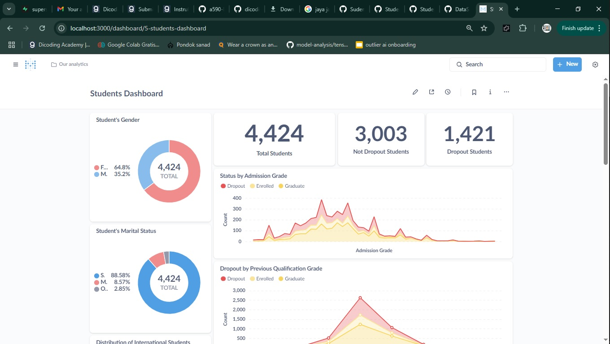

# Proyek Akhir: Menyelesaikan Permasalahan Perusahaan Edutech

## Business Understanding

Sebuah perusahaan edutech ingin memahami faktor-faktor yang memengaruhi mahasiswa melakukan **dropout** atau tidak menyelesaikan studi mereka. Dropout dapat menyebabkan kerugian baik bagi institusi pendidikan maupun mahasiswa itu sendiri, baik dari segi finansial maupun reputasi. Maka dari itu, penting bagi perusahaan untuk **mengidentifikasi mahasiswa yang berpotensi dropout** sejak dini agar dapat dilakukan intervensi tepat waktu.

### Permasalahan Bisnis

* Mahasiswa melakukan dropout tanpa diketahui penyebabnya secara pasti.
* Tidak adanya sistem prediksi untuk mendeteksi risiko dropout sejak awal.
* Sulit bagi institusi untuk menentukan strategi pencegahan dropout yang tepat tanpa data pendukung.

### Cakupan Proyek

* Melakukan eksplorasi dan visualisasi data untuk menemukan pola dropout.
* Melatih model machine learning untuk memprediksi kemungkinan mahasiswa dropout.
* Membangun aplikasi prediksi berbasis **Streamlit** yang dapat digunakan oleh pihak institusi untuk memprediksi risiko dropout berdasarkan data mahasiswa.

### Persiapan

Sumber data: ([Link File](https://github.com/dicodingacademy/dicoding_dataset/blob/main/students_performance/README.md))

Setup environment:

```bash
conda create -n student-do-project python=3.10
conda activate student-do-project
pip install -r requirements.txt
```

---

## Business Dashboard

Business dashboard berupa **visualisasi** dibuat dengan metabase untuk memahami karakteristik mahasiswa yang cenderung dropout. Insight yang diperoleh antara lain:

* Mahasiswa dengan **waktu attendance sore (evening)** memiliki dropout rate paling tinggi, kemungkinan karena mereka juga bekerja.
* Dropout rate lebih tinggi pada mahasiswa **yang tidak menerima beasiswa**, kemungkinan karena kesulitan biaya.
* Mahasiswa yang **memiliki utang (debtor)** cenderung lebih banyak dropout.
* Berdasarkan 4 kebangsaan terbanyak, **mahasiswa asal Brasil** memiliki dropout rate tertinggi.
* Pada 4 program studi terpopuler, program **Manajemen (Evening Attendance)** memiliki dropout rate tertinggi.
* Mahasiswa dengan nilai **Previous Qualification Grade** dan **Admission Grade** yang rendah juga lebih cenderung dropout.



---

## Menjalankan Sistem Machine Learning

Model machine learning yang digunakan adalah **Random Forest Classifier**. Model dilatih menggunakan data yang telah diproses dan disimpan dalam file `rf_model.joblib`. Aplikasi prediksi dibangun menggunakan **Streamlit**.

Untuk menjalankan dapat mengunjungi: [Link Streamlit Cloud](https://student-dropout-byyhqcwcxgm6mpfvaoevsx.streamlit.app/)


Prototype dapat digunakan untuk mengisi data mahasiswa dan memprediksi apakah mahasiswa tersebut berisiko dropout atau tidak.

---

## Conclusion

Model machine learning berhasil dibangun dan mampu memprediksi potensi dropout mahasiswa berdasarkan berbagai variabel demografis dan akademik. Aplikasi berbasis Streamlit memudahkan pihak institusi untuk melakukan deteksi dini terhadap risiko dropout.

### Rekomendasi Action Items

* **Berikan bantuan finansial** atau beasiswa kepada mahasiswa dengan kesulitan biaya, terutama yang tidak mendapatkan beasiswa atau memiliki utang.
* **Pantau mahasiswa evening class** secara lebih intensif, karena mereka memiliki risiko dropout lebih tinggi.
* **Identifikasi mahasiswa dengan nilai rendah** sejak awal dan berikan pendampingan akademik atau mentoring.
* Lakukan **analisis lebih lanjut berdasarkan nationality dan course** untuk mendesain program intervensi yang lebih tepat sasaran.
